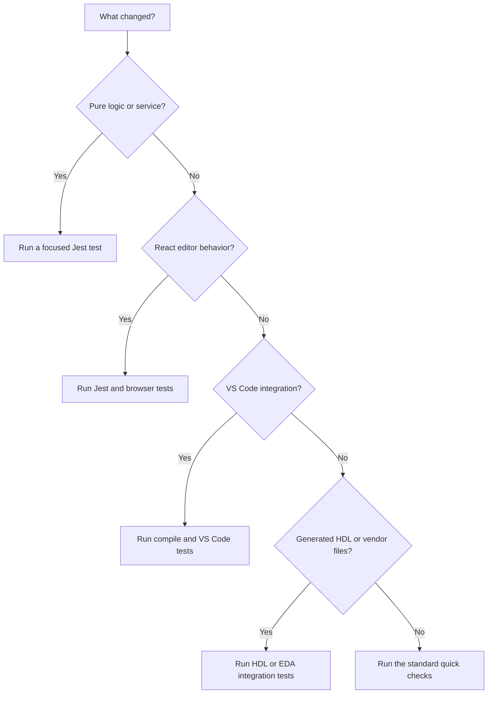

# Testing

Use the smallest test that covers your change, then run the broader checks before opening a pull request.

## Quick start

```bash
npm run lint
npm run type-check
npm test
npm run compile
```

`npm test` runs the unit tests. The `pretest` step also checks that the
`ipcraft-spec` submodule is available. If it is missing, run:

```bash
git submodule update --init --recursive
```

## Choose the right test



| Change | Start with | Also run |
|---|---|---|
| Algorithm, parser, service, or utility | `npm test` | `npm run type-check` |
| React component or editor interaction | `npm test` | `npm run test:browser` |
| Extension host or VS Code command | `npm run compile` | `npm run test:e2e` |
| Generator template or HDL output | `npm run test:integration:hdl` | Relevant vendor test |
| Documentation only | `mkdocs build --strict` | Link and spelling review |

## Test suites

### Unit tests

Unit tests use Jest and cover pure functions, services, and React components.
The Jest configuration is not in the repository root, so always pass it when
running one file or one named test:

```bash
npx jest --config config/jest.config.js src/test/suite/services/YamlValidator.test.ts
npx jest --config config/jest.config.js -t "should parse valid YAML"
```

Run the complete unit suite with:

```bash
npm test
```

Tests use the shared VS Code mock in `__mocks__/vscode.ts`. Extend that mock
when a test needs another VS Code API. Do not create a separate mock in each
test file.

### Browser tests

Browser tests use Playwright to exercise the Memory Map and IP Core webviews
without starting VS Code:

```bash
npm run compile
npm run test:browser
```

The test harness passes YAML to the webview through `window.__RENDER__`.
Use browser tests for keyboard navigation, drag behavior, focus, and other
interactions that depend on a real browser.

### VS Code tests

These tests start a real VS Code Extension Development Host:

```bash
npm run compile
npm run test:e2e
```

Use them for extension activation, command registration, custom editors, and
behavior that depends on VS Code itself.

### HDL integration tests

These tests generate HDL and compile it with GHDL or Icarus Verilog:

```bash
npm run test:integration:hdl
```

Use this suite after changing schemas, generator logic, or HDL templates.

### Vendor integration tests

Vendor tests validate generated Quartus and Vivado projects:

```bash
npm run test:integration:quartus
npm run test:integration:vivado
```

These tests need the matching vendor tools or configured container support.
See [Run the EDA integration tests](how-to/run-eda-integration-tests.md).

## Where tests live

| Test type | Location | Environment |
|---|---|---|
| Unit and React tests | `src/test/suite/` | Jest with jsdom |
| VS Code tests | `src/test/e2e/` | VS Code Extension Host |
| Browser tests | `src/test/browser/` | Playwright |
| HDL and vendor tests | `src/test/integration/` | Node plus external tools |
| Shared test inputs | `src/test/fixtures/` | YAML and generated examples |

## Writing a test

1. Put the test in the suite that matches the environment it needs.
2. Use the smallest input that demonstrates the behavior.
3. Check the visible result or written document, not an internal detail.
4. Add a regression test when fixing a bug.
5. Run the focused test before running the full suite.

For browser tests, prefer stable roles and labels over CSS implementation
details. For generator tests, check meaningful output and compile it when
possible.

## Common failures

### The submodule is missing

```bash
git submodule update --init --recursive
```

### Browser tests use an old bundle

Rebuild before running Playwright:

```bash
npm run compile
npm run test:browser
```

### A VS Code test cannot find compiled files

Run `npm run compile` first. These tests load compiled output, not TypeScript
source files.

### A mock works once and then disappears

Jest resets mock implementations between tests. Restore the implementation in
`beforeEach`.

### Jest collects the wrong files

Use `--config config/jest.config.js`. Browser tests use Playwright, and VS Code
tests use their own runner.

## Before opening a pull request

```bash
npm run lint
npm run type-check
npm test
npm run compile
```

Then run the browser, VS Code, HDL, or vendor suites that cover the changed
area. In the pull request, state which commands you ran and note any suite you
could not run locally.
