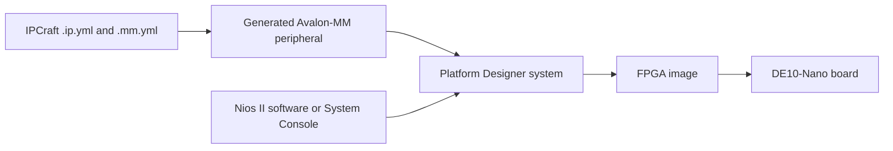
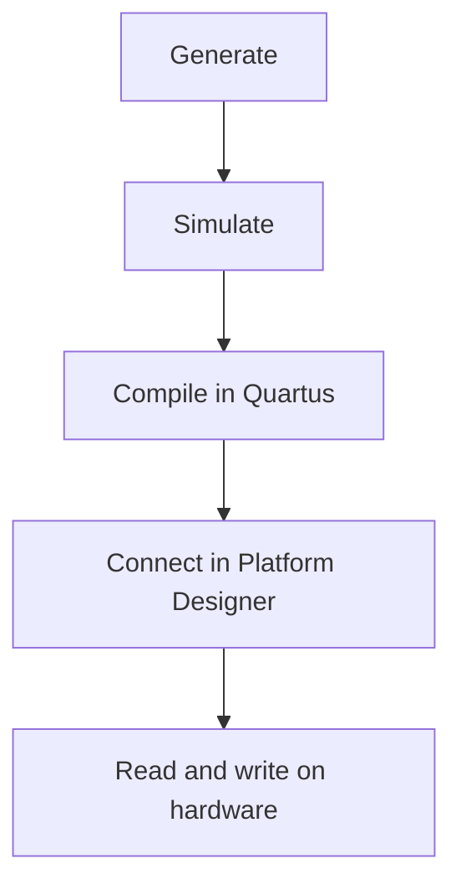

# DE10-Nano Register-Map Case Study

This case study shows where IPCraft fits in a complete Terasic DE10-Nano
project. The board files, software, build scripts, and hardware results live in
the [`cvsoc` repository](https://github.com/bleviet/cvsoc).

## System path

The example register map contains:

- read/write control fields;
- read-only hardware status;
- an event flag that software clears by writing `1`;
- hand-written application logic protected from regeneration.

## Verification stages

| Stage | What it proves |
|---|---|
| Generate | The YAML inputs produce RTL, tests, and Quartus metadata |
| Simulate | Reset, reads, writes, and event clearing behave as specified |
| Compile | Quartus accepts the generated project and reports timing and size |
| Integrate | Platform Designer connects the peripheral to the system bus |
| Run on board | Software reaches the same registers through the real interconnect |

Each stage finds a different class of problem. Simulation can validate register
behavior, but only the board run proves that addresses, interconnect, clocks,
reset, firmware, and generated hardware work together.

## Responsibility boundary

IPCraft owns the path from the IP description to generated component files:

- YAML validation;
- RTL and register logic generation;
- Cocotb test scaffolding;
- Quartus component metadata;
- headless project creation and builds.

The board repository owns:

- pin assignments and clocks specific to the DE10-Nano;
- the surrounding Platform Designer system;
- firmware and programming scripts;
- hardware test logs.

Keeping this boundary clear prevents board-specific instructions from becoming
part of the IPCraft generator documentation.

## Reproduce the IPCraft portion

You do not need the board to repeat the first three stages:

1. [Create an IP core and memory map](../how-to/create-your-first-ip-core.md).
2. [Generate the project](../how-to/generating-a-project.md).
3. [Run the generated simulation](../how-to/run-cocotb-simulation.md).
4. If Quartus is available, [run a headless build](../how-to/building-a-project.md).

For the board-specific stages, see the examples named
`16_ipcraft_led_avmm`, `17_ipcraft_regmap_conformance`, and
`18_ipcraft_regmap_conformance_axil` in `cvsoc`.
