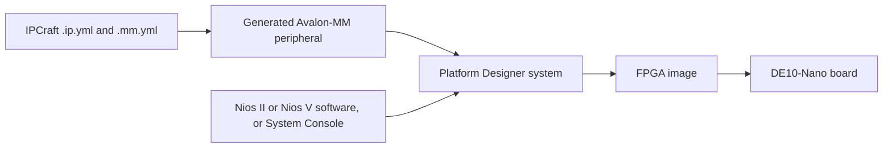
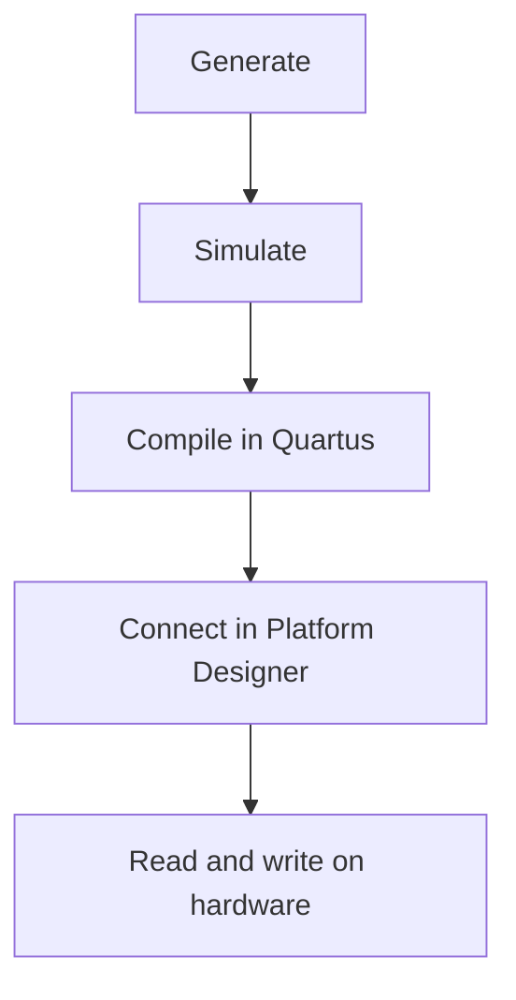

# DE10-Nano Register-Map Case Study

This case study shows where IPCraft fits in a complete Terasic DE10-Nano
project. The maintained board files, build scripts, shared scenarios, and
hardware results live with the generated designs under [`examples/`](../../examples/).

## System path


```mermaid
flowchart LR
    A[IPCraft .ip.yml and .mm.yml] --> B[Generated Avalon-MM peripheral]
    B --> C[Platform Designer system]
    C --> D[FPGA image]
    D --> E[DE10-Nano board]
    F[Nios II or Nios V software, or System Console] --> C
```

The example register map contains:

- read/write control fields;
- read-only hardware status;
- an event flag that software clears by writing `1`;
- hand-written application logic protected from regeneration.

## Verification stages

| Stage        | What it proves                                                    |
| ------------ | ----------------------------------------------------------------- |
| Generate     | The YAML inputs produce RTL, tests, and Quartus metadata          |
| Simulate     | Reset, reads, writes, and event clearing behave as specified      |
| Compile      | Quartus accepts the generated project and reports timing and size |
| Integrate    | Platform Designer connects the peripheral to the system bus       |
| Run on board | Software reaches the same registers through the real interconnect |


```mermaid
flowchart TD
    A[Generate] --> B[Simulate]
    B --> C[Compile in Quartus]
    C --> D[Connect in Platform Designer]
    D --> E[Read and write on hardware]
```

Each stage finds a different class of problem. Simulation can validate register
behavior, but only the board run proves that addresses, interconnect, clocks,
reset, firmware, and generated hardware work together.

## Repository boundary

IPCraft owns the path from the IP description to generated component files:

- YAML validation;
- RTL and register logic generation;
- Cocotb test scaffolding;
- Quartus component metadata;
- headless project creation and builds.

This repository also owns the DE10-Nano harness used to regress those generated
files:

- pin assignments and clocks specific to the DE10-Nano;
- the surrounding Platform Designer system;
- programming and System Console transport scripts;
- the manifest-driven hardware result.

This is a deliberate change from the earlier split with `cvsoc`. The conformance
examples were moved into this repository so their generated manifest, semantic
scoreboard, simulation scenarios, board build, and retained hardware evidence
advance together. `cvsoc` remains the home for complete SoC applications; the
board harness here is narrowly a generator verification target.

The shared contract is:

- `tb/verification_manifest.json` describes the generated register semantics;
- `tb/register_model.py` is the transport-independent expected-value model;
- `tb/conformance_scenarios.py` contains the transactions used by simulation
  and hardware;
- cocotb supplies the simulation Avalon-MM transport;
- `altera/debug/hardware_runner.py` supplies the JTAG-to-Avalon transport and
  writes a machine-readable provenance result.

## Reproduce the IPCraft portion

You do not need the board to repeat the first three stages:

1. [Create an IP core and memory map](../how-to/create-your-first-ip-core.md).
2. [Generate the project](../how-to/generating-a-project.md).
3. [Run the generated simulation](../how-to/run-cocotb-simulation.md).
4. If Quartus is available, [run a headless build](../how-to/building-a-project.md).

For the board-specific stages, use
[`examples/regmap_conformance_avmm/`](../../examples/regmap_conformance_avmm/):

```bash
cd examples/regmap_conformance_avmm/altera
make processor             # niosv on Quartus 24.x/25.x; nios2 on a legacy install
make qsys project compile
# Legacy flow: make PROCESSOR=nios2 USE_DOCKER=1 qsys project compile
```

The platform-specific hardware test target programs a fresh bitstream, verifies the manifest-derived build ID,
runs the same directed and seeded-random scenarios as cocotb, and writes
`output_files/hardware-result.json`. Missing Quartus tools, JTAG services, or
the board produce a nonzero exit; they are never treated as a passing hardware
run.

[`examples/regmap_conformance_axil/`](../../examples/regmap_conformance_axil/)
proves the same register map and manifest-driven suite through the AXI4-Lite
bus wrapper instead, over the same JTAG-to-Avalon-MM master bridged to AXI4
by Platform Designer -- same `make qsys project compile && make test`
workflow, no HPS/Nios II required.
