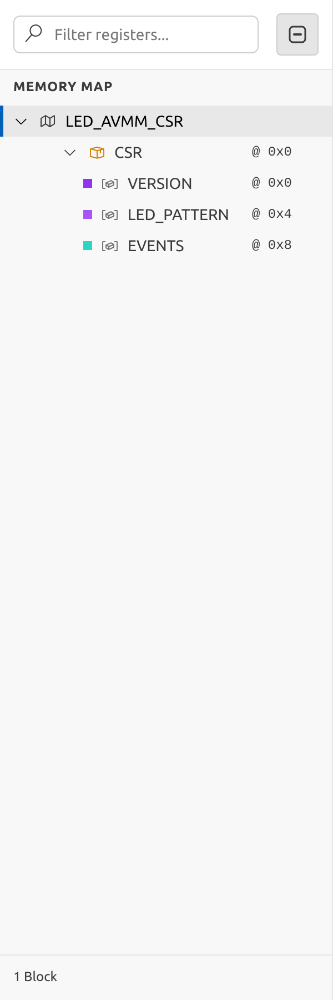
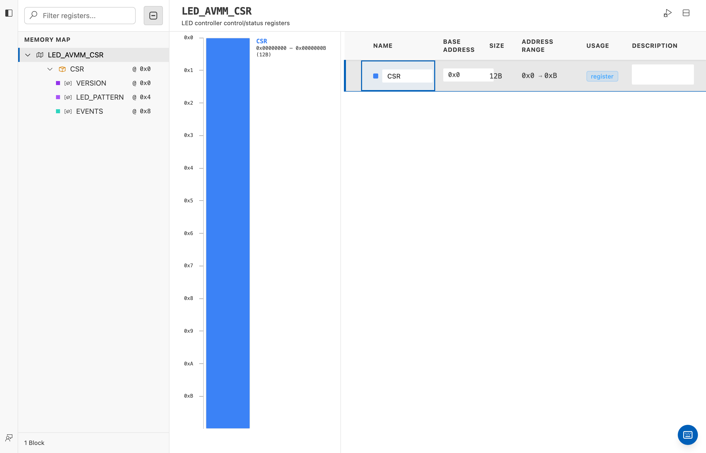
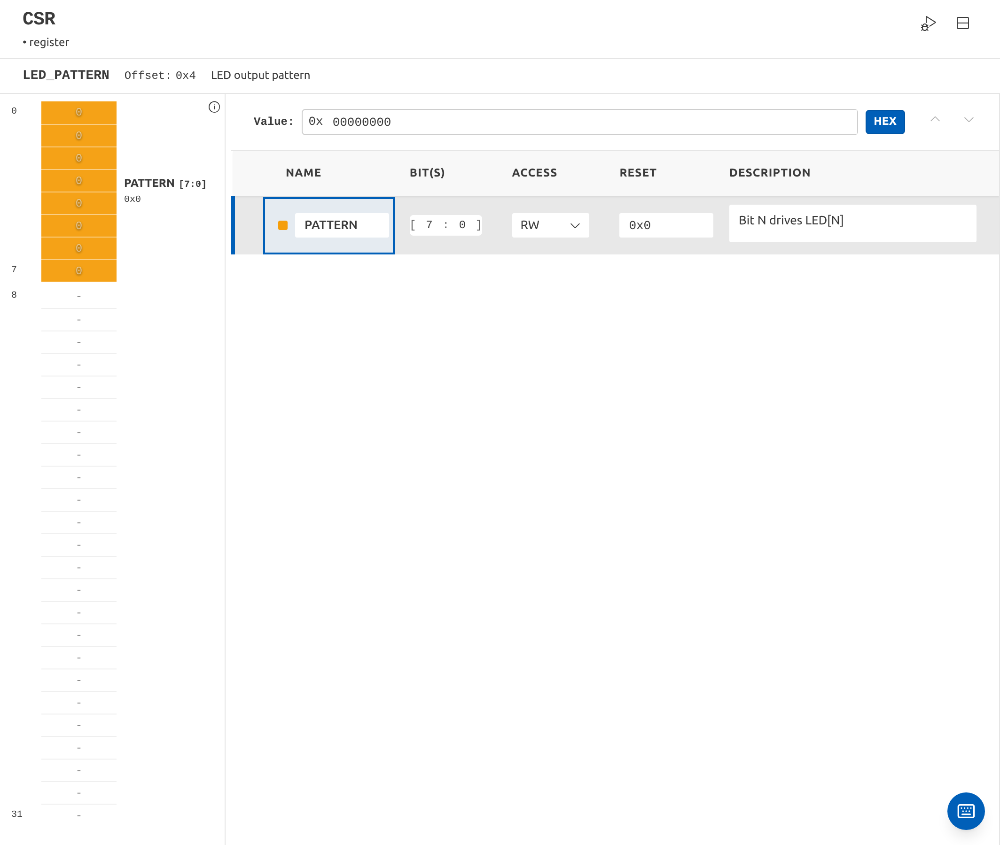
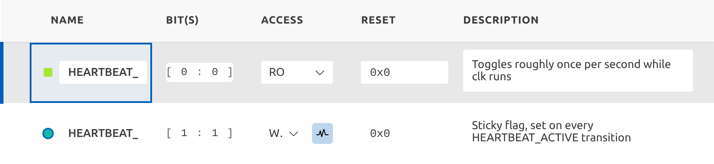
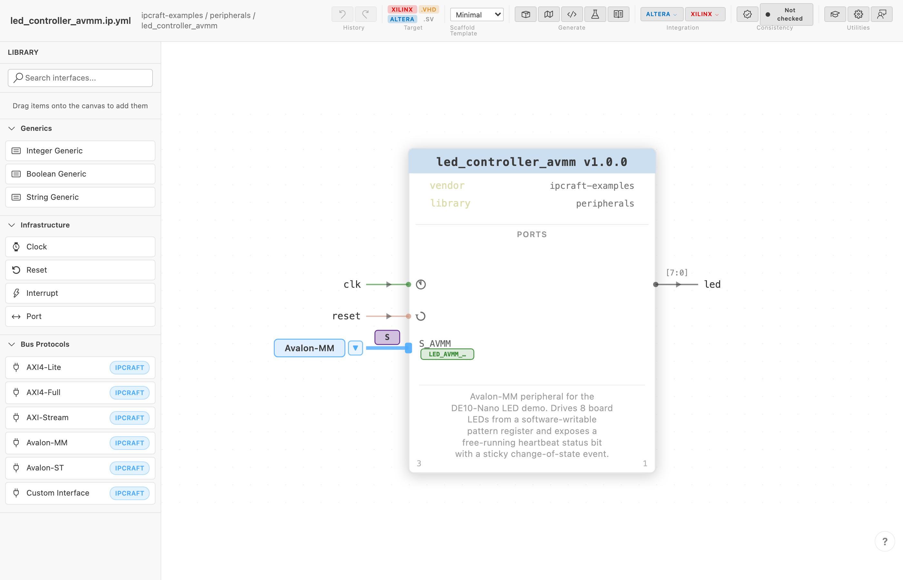

# Authoring an Avalon-MM Peripheral: LED Controller on Real Hardware

This tutorial starts a five-part series that builds a real peripheral for a
real board — the [Terasic DE10-Nano](https://www.terasic.com.tw/), via the
[cvsoc](https://github.com/bleviet/cvsoc) tutorial project — using nothing
but a `.ip.yml`/`.mm.yml` pair and `IPCraft: Scaffold Project`. Every other
IPCraft tutorial verifies correctness against fixtures exercised in CI; this
series verifies it against a peripheral that ends up soldered, synthesized,
and blinking LEDs on physical silicon.

!!! info "What you will learn"
    - How to author an Avalon-MM peripheral's `.ip.yml`/`.mm.yml` from
      scratch for a real-world use case.
    - How `write-1-to-clear` + `monitorChangeOf` codegen behaves on
      generated RTL, not just in the schema.
    - How to protect hand-written files (`fileSets`, `managed: false`) across
      re-scaffolds.
    - Where IPCraft's Avalon-MM bus wrapper has sharp edges — because we hit
      two of them building this.

!!! info "This tutorial is grounded in a real gap, not a toy example"
    cvsoc's own roadmap ([`docs/roadmap.md`](https://github.com/bleviet/cvsoc/blob/main/docs/roadmap.md),
    Phase 2.2) called for a custom `led_controller_avmm.vhd` Avalon-MM slave
    years before this tutorial existed — "one write register for LED
    pattern, one read register for LED status" — and never built it;
    `04_nios2_led` shipped with the stock `altera_avalon_pio` instead. This
    tutorial builds exactly that missing peripheral, with IPCraft instead of
    hand-written VHDL, as cvsoc's new `16_ipcraft_led_avmm` phase.

---

## The register map



cvsoc's roadmap asked for two registers; we add a third to exercise
`write-1-to-clear` and `monitorChangeOf` — using the exact pattern already
proven in [`comprehensive_avalon.mm.yml`](https://github.com/bleviet/ipcraft-spec/blob/main/examples/comprehensive_avalon/comprehensive_avalon.mm.yml)'s
`EVENTS.SRC_ACTIVE`/`SRC_TOGGLED` fields, not a new, unvalidated shape:

| Offset | Register | Access | Fields |
|--------|----------|--------|--------|
| `0x00` | VERSION | read-only | `MINOR[7:0]`, `MAJOR[15:8]` |
| `0x04` | LED_PATTERN | read-write | `PATTERN[7:0]` — bit N drives `LED[N]` |
| `0x08` | EVENTS | read-write-1-to-clear | `HEARTBEAT_ACTIVE[0]` (read-only), `HEARTBEAT_TOGGLED[1]` (write-1-to-clear, `monitorChangeOf: HEARTBEAT_ACTIVE`) |



Selecting `LED_PATTERN` drops into the bit-field visualizer — `PATTERN[7:0]`
drives `led`, and bits 8-31 stay reserved:



`HEARTBEAT_ACTIVE` is a free-running divider driven entirely in hardware — a
liveness signal, not a readback of a value software wrote. Deliberately, no
new DE10-Nano board pins are introduced (there's no verified pin-out source
for the board's push buttons in this exercise), so the "status" register is
fully bench-verifiable over the Nios II JTAG UART without new board wiring.

```yaml
- name: LED_AVMM_CSR
  addressBlocks:
    - name: CSR
      baseAddress: 0
      usage: register
      registers:
        - name: EVENTS
          offset: 8
          access: read-write-1-to-clear
          fields:
            - name: HEARTBEAT_ACTIVE
              bits: '[0:0]'
              access: read-only
            - name: HEARTBEAT_TOGGLED
              bits: '[1:1]'
              access: write-1-to-clear
              monitorChangeOf: HEARTBEAT_ACTIVE
```

This is exactly what the EVENTS register looks like in the fields table —
the monitor icon on `HEARTBEAT_TOGGLED` is the `monitorChangeOf` link back
to `HEARTBEAT_ACTIVE`:



`monitorChangeOf` only supports **sibling fields in the same register** —
the register file compares `HEARTBEAT_ACTIVE`'s value cycle-to-cycle against
an internal shadow register and sets `HEARTBEAT_TOGGLED` on any transition,
entirely inside the generated `_regs.vhd`. The core only has to drive the
live level:

```vhdl
-- rtl/led_controller_avmm_core.vhd (the one hand-written file)
led <= regs_in.led_pattern.pattern;
...
regs_out.events_val.heartbeat_active <= heartbeat_counter(heartbeat_counter'high);
```

## Scaffolding the project

With `led_controller_avmm.ip.yml` and `.mm.yml` written, `IPCraft: Scaffold
Project` (pointed at the phase directory itself, so `rtl/`, `tb/`, and
`altera/` land as siblings of cvsoc's own `qsys/`/`quartus/`/`software/`
folders) generates the full layered set: package, register file, bus
wrapper, core stub, and top entity.



## Three real bugs, found by using it for something real

This is the point of the whole series: a real target surfaces problems a
synthetic fixture doesn't.

**Bug 1 — an Avalon-MM slave with no `useOptionalPorts` produced invalid
VHDL.** Every port in `avalon_mm.yml`'s bus definition is `presence:
optional` — even `address`, `read`, and `write`. `bus_avmm.vhdl.j2` guarded
its port-list block with ``, but Nunjucks treats an empty
array as **truthy** (JS semantics — unlike Jinja2/Python, where an empty list
is falsy). So an Avalon-MM slave authored without an explicit
`useOptionalPorts` list produced an entity with a bare `;` where its port
list should have been — a compile error, not a functional bug, but on the
very first scaffold. Fixed upstream: ``, with
a regression test (`IpCoreScaffolder.test.ts`) that fails without the fix
and passes with it.

**Bug 2 — `altera_hw_tcl.j2` generated `addressUnits WORDS` but the RTL
decodes byte offsets.** The register file compares the address signal against
`.mm.yml` byte offsets directly (`C_REG_LED_PATTERN_ADDR = 4`,
`C_REG_EVENTS_ADDR = 8`). With `addressUnits WORDS`, Platform Designer
divides the CPU's byte offset by 4 before driving `avs_address` — so a
write to LED\_PATTERN at byte offset `0x04` arrives as word address `1`, not
`4`, and the decode never matches. Only the first register (VERSION, offset
`0`) was reachable in hardware. Fixed in `altera_hw_tcl.j2`:
`addressUnits BYTES`. With BYTES, Platform Designer passes byte offsets
directly to the port, the `C_ADDR_WIDTH-1 downto 0` slice picks up the right
bits, and all three registers decode correctly. `C_ADDR_WIDTH` stays at `4`
(computed by `addressingResolver` as `ceil(log2(span=16 bytes))`) and the
address port remains at its default 32-bit width — no `portWidthOverrides`
needed.

**Bug 3 — `printf` pulls newlib's full vfprintf into a 32 KB on-chip RAM.**
`main.c` used `printf` with `%08lX`. Newlib's `printf` always links
`vfprintf`, `dtoa`, `mprec`, and a heap of locale/reent infrastructure
regardless of the format specifiers used — about 24 KB of `.text` alone,
which overflows the 32 KB on-chip RAM at link time. The fix: switch to
`alt_printf` from `sys/alt_stdio.h`, which supports `%x`, `%s`, and `%c`
with a ~1 KB footprint. Format strings are adjusted to use `%x` (no
zero-padding or uppercase) — the version self-test still catches a mismatch,
it just prints `0x100` instead of `0x00000100`.

## Verification

- `IPCraft: Scaffold Project` completes without error.
- GHDL `-a`/`-e` (VHDL-2008) analyzes and elaborates the full generated +
  hand-edited RTL cleanly — zero warnings once all three bugs above were
  fixed.
- `rtl/led_controller_avmm_core.vhd` and `tb/led_controller_avmm_test.py` are
  marked `managed: false` in `fileSets`, verified to survive a re-scaffold.

Next: [Part 2](led-controller-avmm-simulation.md) simulates this peripheral
with cocotb before it ever touches hardware.
