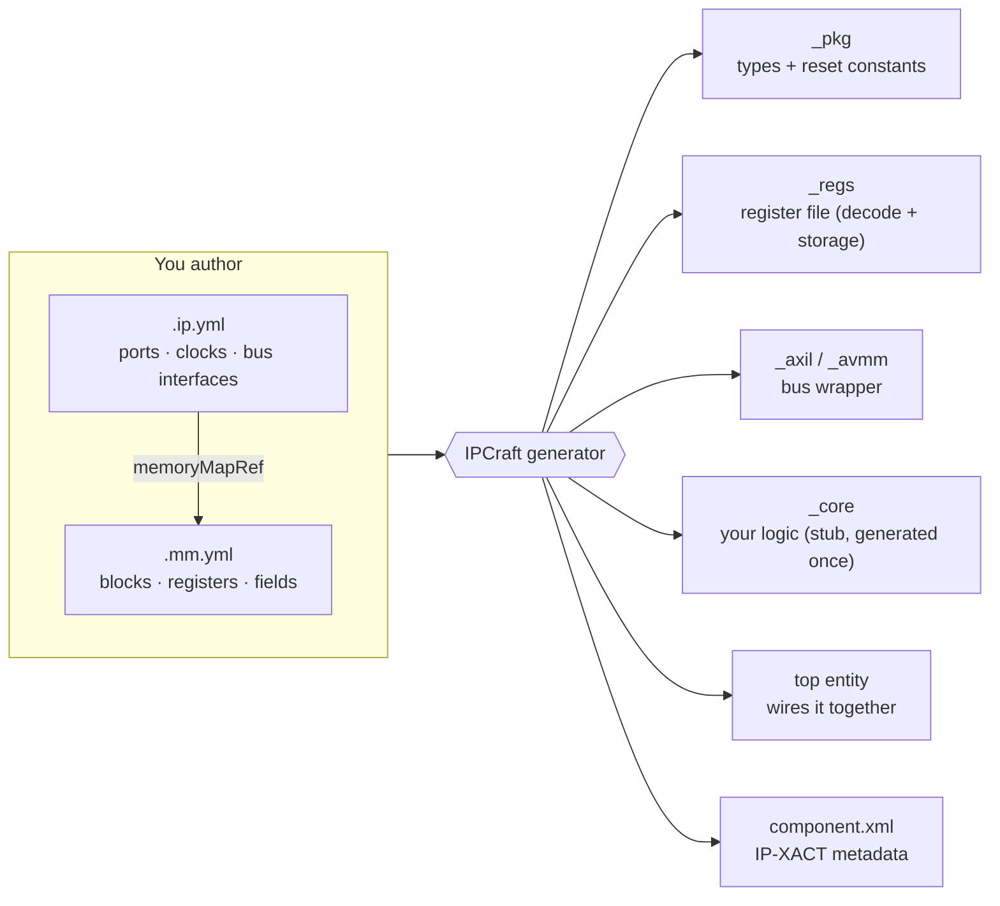
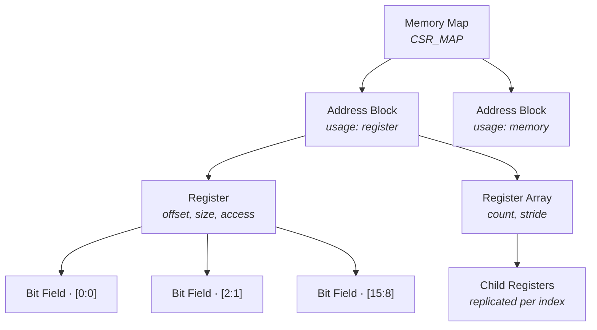
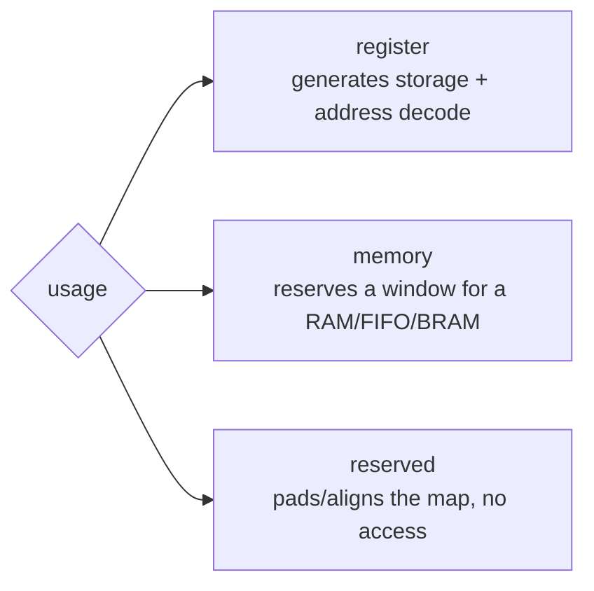
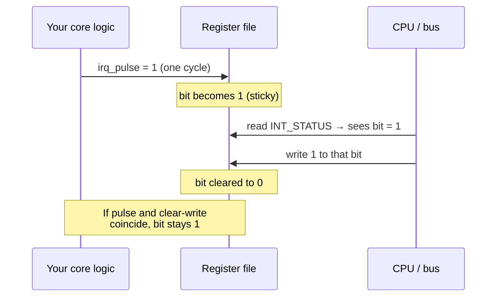
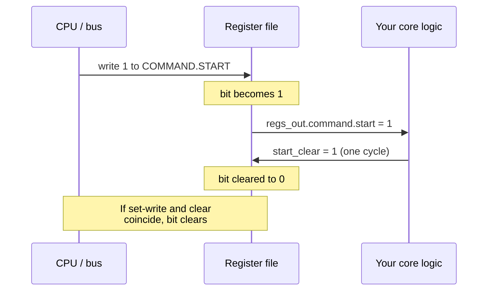
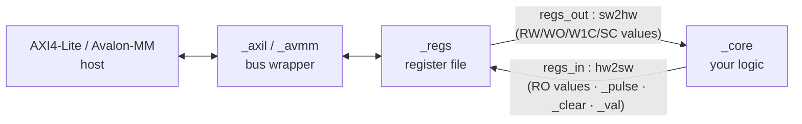
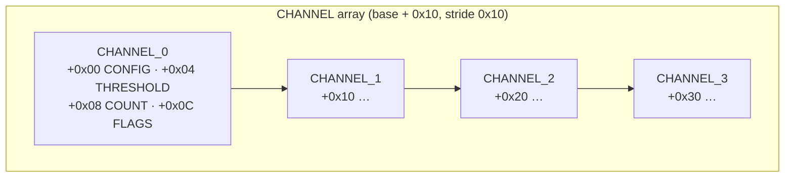
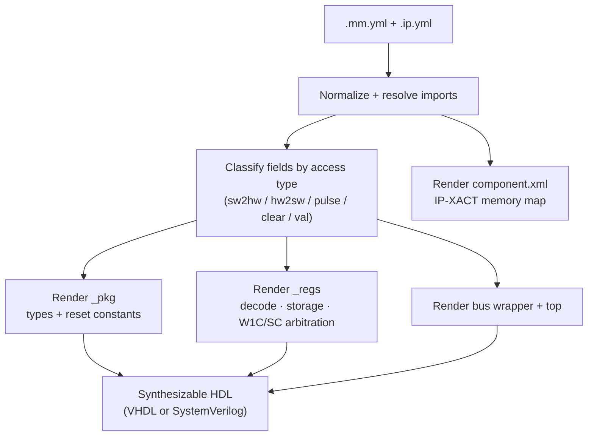

# Memory-Mapped Registers

This tutorial explains the IPCraft methodology for describing a memory-mapped
register interface and turning it into synthesizable HDL: address blocks,
registers, register arrays, memory regions, bit fields, and the seven access
types that govern how software and hardware share a register. Every concept is
paired with a small YAML fragment, and the full worked example at the end is a
**real fixture in this repository** — not a hypothetical.

!!! info "What you will learn"
    - How an `.ip.yml` and an `.mm.yml` divide responsibility, and how they link.
    - The address-block / register / register-array / bit-field hierarchy.
    - All seven field access types, and which one to reach for.
    - The `regs_out` / `regs_in` hardware contract your logic connects to.
    - How to model register arrays and non-register memory windows.

> **Related reading:** [YAML Data Flow](../concepts/yaml-data-flow.md) for how
> files move through the editor, [The Generator Backbone](../concepts/generator-backbone.md)
> for the template pipeline, and [Specification Schemas](../reference/specification-schemas.md)
> for the authoritative field list.

!!! info "This tutorial is tested, not just described"
    The worked example below —
    [`daq_controller`](https://github.com/bleviet/ipcraft-spec/tree/main/examples/daq_controller) —
    lives in the `ipcraft-spec` submodule and is exercised by this repository's
    integration tests on every run: it is generated in both VHDL and
    SystemVerilog, analyzed and elaborated with **GHDL**, compiled with
    **Icarus Verilog**, linted with **Verilator**, and round-tripped through
    IP-XACT (`component.xml`). The YAML shown in this page is included directly
    from that fixture, so what you read here is exactly what the test suite
    verifies.

---

## The mental model

An IPCraft peripheral is described by **two** files with different jobs:

| File | Extension | Responsibility |
|------|-----------|----------------|
| IP Core | `.ip.yml` | The component: its ports, clocks, resets, parameters, and **bus interfaces**. One bus interface *references* a memory map. |
| Memory Map | `.mm.yml` | The register layout: address blocks, registers, and bit fields, with their access semantics. |

The IP core says *"this AXI4-Lite slave is controlled by the register set named
`CSR_MAP`"*; the memory map says *"here is what `CSR_MAP` contains"*. Keeping
them separate means one register layout can be reused across cores, and the
layout can be imported, versioned, and diffed on its own.



The generator emits a **bus wrapper** (protocol handshakes), a **register
file** (address decode + storage), a **package** (record/struct types and
reset values), a **core stub** (where your logic lives), and a **top** that
connects them. The register file exposes your registers to your logic through
two aggregate records — the heart of the contract, described in
[The generated hardware contract](#the-generated-hardware-contract).

---

## Anatomy of a memory map

A memory map is a strict four-level hierarchy:



- A **memory map** groups everything under one name and description.
- An **address block** is a contiguous span of the address space with a
  `usage` (`register`, `memory`, or `reserved`) and a base address.
- A **register** is one addressable word inside a `register` block.
- A **bit field** is a named range of bits inside a register, carrying the
  access semantics.

The top-level `.mm.yml` document is a **list** of memory maps:

```yaml
- name: CSR_MAP
  description: Control/status registers for the peripheral
  addressBlocks:
    - name: REGS
      baseAddress: 0x0000
      usage: register
      defaultRegWidth: 32
      registers:
        # ... registers go here
```

---

## Address blocks

An address block reserves a region of the peripheral's address space and
declares what kind of thing lives there.

| Field | Meaning |
|-------|---------|
| `name` | Block identifier. |
| `baseAddress` | Start address of the block (bytes). Accepts integers or `0x` hex. |
| `range` | Size of the block. Accepts a number of bytes or a suffix string (`4K`, `1M`). |
| `usage` | `register`, `memory`, or `reserved`. |
| `defaultRegWidth` | Default register width in bits for registers in this block (typically 32). |

### Usage types



- **`register`** — the generator emits a register file: per-register storage,
  an address decoder, read/write logic, and the hardware ports for your
  fields. This is the block type this tutorial is mostly about.
- **`memory`** — declares an address window backed by a separate memory (a
  BRAM, FIFO, or external RAM), *not* by generated registers. No per-word
  storage is generated; the window is surfaced in the IP-XACT metadata so
  integration tools know the address space is occupied. Use it to reserve,
  say, a sample buffer.
- **`reserved`** — marks an address range as unavailable (padding, future
  expansion). No access logic, no storage.

```yaml
addressBlocks:
  - name: REGS
    baseAddress: 0x0000
    usage: register
    defaultRegWidth: 32
    registers: [ ... ]

  - name: SAMPLE_BUFFER
    baseAddress: 0x1000
    range: 4K
    usage: memory        # a 4 KB window for a separate BRAM, no registers here
```

---

## Registers

A register is one addressable location in a `register` block.

| Field | Default | Meaning |
|-------|---------|---------|
| `name` | — | Register identifier (becomes the field-record member name). |
| `offset` | — | Byte offset from the block's `baseAddress`. |
| `size` | 32 | Register width in bits. |
| `access` | `read-write` | Default access for the register; individual fields can override. |
| `resetValue` | 0 | Reset value for the whole register (see note below). |
| `description` | "" | Human-readable description. |
| `fields` | [] | The bit fields (see next section). |

A register almost always carries **fields**; the fields' access types are what
drive HDL generation. The register-level `access` is a convenience default
when every field shares the same semantics.

```yaml
registers:
  - name: CONTROL
    offset: 0x00
    description: Global control
    fields:
      - { name: ENABLE, bits: '[0:0]',  access: read-write, resetValue: 0 }
      - { name: MODE,   bits: '[2:1]',  access: read-write, resetValue: 1 }
      - { name: PRESCALER, bits: '[15:8]', access: read-write, resetValue: 0x04 }
```

!!! note "Reset values live on fields"
    The effective reset comes from each field's `resetValue`, assembled into
    the register's reset constant, and is honored correctly in both the
    generated **VHDL** and **SystemVerilog**. A register-level `resetValue`
    is also honored, but only for a register with no fields at all — it does
    not fill the gaps between fields in a register that has some.

---

## Bit fields

A bit field is a named range of bits within a register. Its **access type**
determines the storage, the read behavior, and which hardware ports the
generator produces.

| Field | Meaning |
|-------|---------|
| `name` | Field identifier (becomes a record/struct member). |
| `bits` | Range string, MSB-first: `'[7:0]'`, `'[0:0]'`, `'[15:8]'`. |
| `offset` + `width` | Alternative to `bits`: LSB position + number of bits. |
| `access` | One of the seven access types (next section). |
| `resetValue` | Reset value for this field. |
| `description` | Human-readable description. |
| `enumeratedValues` | `{ value: name }` map documenting named encodings. Descriptive metadata — it enriches the editor and IP-XACT output but does not change generated RTL logic. |
| `monitorChangeOf` | Change-of-state monitoring (see [Change-of-state](#change-of-state-fields)). |

Two equivalent ways to place a field:

```yaml
# Range string (MSB-first) — most common
- { name: MODE, bits: '[2:1]', access: read-write }

# Explicit offset + width (LSB position, bit count)
- { name: MODE, offset: 1, width: 2, access: read-write }
```

Fields within a register should not overlap, and bits not covered by any field
typically read back as their reset value.

---

## Access types

Access type is the most important concept in the whole model. It answers
three questions at once: *can software read it, what does a software write
do, and what is hardware's role?* IPCraft supports seven access types.

| Access token | SW read | SW write | Hardware role | Generated HW port | Typical use |
|--------------|---------|----------|---------------|--------------------|-------------|
| `read-only` | live HW value | ignored | **drives** the value | `regs_in.<reg>` | Status bits |
| `write-only` | reads 0 | stores value | reads the value | `regs_out.<reg>` | Latched controls not meant to read back |
| `read-write` | stored value | stores value | reads the value | `regs_out.<reg>` | Configuration |
| `write-1-to-clear` | reads 0 | writing `1` **clears** a bit | **pulses to set** | `regs_out.<reg>` + `regs_in.<reg>_pulse` | Event flags (write-only) |
| `read-write-1-to-clear` | sticky value | writing `1` **clears** a bit | **pulses to set** | `regs_out.<reg>` + `regs_in.<reg>_pulse` | Interrupt status flags |
| `write-self-clearing` | reads 0 | writing `1` **sets** a bit | **pulses to clear** | `regs_out.<reg>` + `regs_in.<reg>_clear` | Command / "go" strobes |
| `read-write-self-clearing` | value | writing `1` **sets** a bit | **pulses to clear** | `regs_out.<reg>` + `regs_in.<reg>_clear` | Busy/command with readback |

A few rules make this table easier to remember:

- The `read-` prefix decides **readability**. `write-only`,
  `write-1-to-clear`, and `write-self-clearing` read back as `0`. Their
  `read-write-…` counterparts read back the stored value.
- **`…-1-to-clear`** is a *sticky flag set by hardware, cleared by the CPU
  writing a 1* to the bit. It is the interrupt-flag idiom.
- **`…-self-clearing`** is the mirror image: *set by the CPU writing a 1,
  cleared by hardware*. It is the command/handshake idiom.
- When a hardware event and a CPU action land in the **same cycle**, the
  hardware event wins. For W1C the set beats the clear (no event is lost);
  for self-clearing the clear beats the set (the strobe cannot get stuck).

This behavior — including the same-cycle arbitration rule — is verified
behaviorally (not just compiled) against the `daq_controller` fixture; see
[Test coverage](#test-coverage) at the end of this page.

### Write-1-to-clear (interrupt flags)

Hardware raises a one-cycle pulse to *set* a sticky bit. The CPU later clears
it by writing a `1` to that bit position. Writing `0` leaves the bit
unchanged.



```yaml
- name: INT_STATUS
  offset: 0x08
  description: Interrupt status (write 1 to clear)
  fields:
    - { name: SAMPLE_DONE, bits: '[0:0]', access: read-write-1-to-clear }
    - { name: OVERFLOW,    bits: '[1:1]', access: read-write-1-to-clear }
    - { name: ERROR,       bits: '[2:2]', access: read-write-1-to-clear }
```

Your logic drives a `…_pulse` strobe for each flag; the field value is
available on `regs_out` so your logic can also observe the current sticky
state.

### Self-clearing (command / "go" bits)

The CPU sets a bit by writing a `1`; hardware clears it once the action is
accepted. This models a fire-and-forget command whose bit auto-returns to
`0`.



```yaml
- name: COMMAND
  offset: 0x0C
  description: One-shot commands (self-clearing)
  fields:
    - { name: START,      bits: '[0:0]', access: write-self-clearing }
    - { name: STOP,       bits: '[1:1]', access: write-self-clearing }
    - { name: FIFO_RESET, bits: '[2:2]', access: write-self-clearing }
```

!!! note "Choosing field names"
    Avoid field names that collide with reserved words in downstream tools —
    for example, `ABORT` triggers a `SYMRSVDWORD` lint warning in Verilator
    because it matches the C standard library's `abort()`. `STOP` above is the
    same concept, without the collision.

### Change-of-state fields

A `write-1-to-clear` / `read-write-1-to-clear` field can automatically flag
when **another field in the same register changes**, using
`monitorChangeOf`. Instead of your logic driving an external pulse, the
generator builds an internal shadow register and a comparator: whenever the
monitored field's live value differs from its shadow, the flag is set (and
cleared the usual W1C way).

```yaml
- name: LINK_STATUS
  offset: 0x10
  fields:
    - name: SPEED           # the monitored value — driven by hardware
      bits: '[3:0]'
      access: read-only
    - name: SPEED_CHANGED   # flag raised whenever SPEED changes
      bits: '[8:8]'
      access: read-write-1-to-clear
      monitorChangeOf: SPEED
```

The monitored field's live value is delivered to the register file on a
dedicated `…_val` port; no external pulse port is generated for the
change-of-state field. `monitorChangeOf` is only valid on a write-1-to-clear
field, and must name a field in the same register.

This exact `LINK_STATUS` pattern is in the `daq_controller` fixture (at
offset `0x50`) and is verified behaviorally: changing `SPEED` auto-sets
`SPEED_CHANGED` with no external pulse, and a write of `1` clears it.

!!! note "Shadow register reset"
    The internal shadow register that backs `monitorChangeOf` is synchronously
    reset by `rst` in both generated languages, initialized to the monitored
    field's own `resetValue`. The first post-reset comparison is therefore
    always a match — no spurious change-of-state event on either language.

---

## The generated hardware contract

The register file connects the bus to your logic through **two aggregate
records** (VHDL) / **packed structs** (SystemVerilog):



- **`regs_out` (`sw2hw`)** — everything software can write: `read-write`,
  `write-only`, and the sticky value of `…-1-to-clear` / `…-self-clearing`
  fields. Your logic **reads** these.
- **`regs_in` (`hw2sw`)** — everything hardware supplies:
  - `read-only` register values (your logic **drives** them),
  - `<reg>_pulse` — one-cycle **set** strobes for W1C fields,
  - `<reg>_clear` — one-cycle **clear** strobes for self-clearing fields,
  - `<reg>_val` — live values monitored by change-of-state fields.

Concretely, for the `daq_controller` fixture below the generator produces
members like:

```
regs_out.control.enable            -- read-write field, driven by SW, read by your logic
regs_in.status.ready                -- read-only field, driven by your logic
regs_in.int_status_pulse.error_pulse    -- pulse to set the W1C ERROR flag
regs_out.int_status.error           -- current sticky value of that flag
regs_in.command_clear.start_clear       -- pulse to clear the self-clearing START bit
```

Names are lower-cased; array instances and change-of-state ports follow the
same pattern. Your editable logic lives in `_core`, which is generated
**once** and then owned by you — regenerating the memory map updates `_pkg`
and `_regs` without touching your `_core`.

---

## Register arrays

When you need many identical registers — one set per DMA channel, per port,
per lane — describe the pattern once and replicate it with `count` and
`stride`. There are two shapes.

### Group arrays (a repeated block of registers)

A register with `count`, `stride`, and **child `registers`** replicates the
whole group. Child offsets are relative to each instance's base; `stride` is
the byte distance between instances.

```yaml
- name: CHANNEL
  count: 4          # four channels
  stride: 16        # each channel occupies 16 bytes
  description: Per-channel configuration
  registers:
    - name: CONFIG
      offset: 0
      fields:
        - { name: GAIN,   bits: '[3:0]',  access: read-write }
        - { name: OFFSET, bits: '[15:8]', access: read-write }
    - name: THRESHOLD
      offset: 4
      fields:
        - { name: VALUE, bits: '[15:0]', access: read-write }
    - name: COUNT
      offset: 8
      fields:
        - { name: SAMPLES, bits: '[31:0]', access: read-only }
    - name: FLAGS
      offset: 12
      fields:
        - { name: TRIGGERED, bits: '[0:0]', access: read-write-1-to-clear }
```

This expands to `CHANNEL_0_CONFIG`, `CHANNEL_0_THRESHOLD`, …
`CHANNEL_3_FLAGS`, laid out like this:



Each expanded register keeps its own access types, so a channel can mix
configuration (`read-write`), status (`read-only`), and per-channel interrupt
flags (`read-write-1-to-clear`) — exactly as if you had written all sixteen
registers by hand.

### Flat arrays (a repeated single register)

A register with `count` but **no child registers** replicates just itself,
producing `NAME_0`, `NAME_1`, … Each instance is one word; `stride` defaults
to the register width.

```yaml
- name: LUT_ENTRY
  count: 8
  stride: 4
  fields:
    - { name: VALUE, bits: '[31:0]', access: read-write }
```

### Alignment guidance

!!! note "Addresses are decoded from each register's offset"
    The generated RTL decodes register addresses from each register's
    resolved `offset`, matching the address the generated `component.xml`
    reports — non-contiguous layouts (reserved gaps, hand-chosen addresses)
    work correctly. Even so, prefer keeping register blocks contiguous and
    word-aligned (consecutive offsets `0x00`, `0x04`, `0x08`, …, with array
    `stride` matching the packed size of the group) — it keeps the map easy
    to read and avoids wasting address space.

---

## Memory regions

Not every part of a peripheral's address space is registers. A block with
`usage: memory` reserves a window for a memory that lives outside the
register file — a sample buffer, a descriptor RAM, a scratchpad.

```yaml
- name: SAMPLE_BUFFER
  baseAddress: 0x1000
  range: 4K
  usage: memory
  description: 1024-entry, 32-bit sample buffer (backed by a BRAM)
```

The generator does **not** create per-word storage or field ports for a
memory block; it records the window in the IP-XACT metadata so integration
tools account for the address range. You connect the actual memory (a BRAM,
a second AXI interface, etc.) in your own logic or system integration. Use
`usage: reserved` similarly when you only need to *pad* the address map.

---

## Worked example: `daq_controller`

A small but complete data-acquisition peripheral that exercises every
concept above and **all seven access types plus change-of-state**: mixed
RW/RO/enum config, a read-only status word, readable interrupt flags (RW1C),
self-clearing commands, a four-instance channel array, a memory window, a
write-only diagnostic register, a plain (non-readable) write-1-to-clear
register, a readable self-clearing busy flag, and a change-of-state field
built on `monitorChangeOf`.

The files below are included directly from
[`ipcraft-spec/examples/daq_controller/`](https://github.com/bleviet/ipcraft-spec/tree/main/examples/daq_controller)
— the same fixture the automated test suite generates and simulates.

### `daq_controller.ip.yml`

```yaml
--8<-- "ipcraft-spec/examples/daq_controller/daq_controller.ip.yml"
```

### `daq_controller.mm.yml`

```yaml
--8<-- "ipcraft-spec/examples/daq_controller/daq_controller.mm.yml"
```

### Resulting address map

| Offset | Register | Access | Notes |
|--------|----------|--------|-------|
| `0x00` | `CONTROL` | RW | `ENABLE`, `MODE` (enum), `IRQ_EN`, `PRESCALER` |
| `0x04` | `STATUS` | RO | hardware-driven status |
| `0x08` | `INT_STATUS` | RW1C | readable interrupt flags |
| `0x0C` | `COMMAND` | self-clearing | one-shot commands |
| `0x10`–`0x1F` | `CHANNEL_0` | mixed | CONFIG / THRESHOLD / COUNT / FLAGS |
| `0x20`–`0x2F` | `CHANNEL_1` | mixed | " |
| `0x30`–`0x3F` | `CHANNEL_2` | mixed | " |
| `0x40`–`0x4F` | `CHANNEL_3` | mixed | " |
| `0x50` | `LINK_STATUS` | RO + RW1C/CoS | `SPEED` (RO), `SPEED_CHANGED` (change-of-state) |
| `0x54` | `DIAG` | write-only | `SCRATCH` — reads back as 0 |
| `0x58` | `IRQ_LEGACY` | write-1-to-clear | plain W1C, not readable (unlike `INT_STATUS`) |
| `0x5C` | `BUSY_STATUS` | read-write-self-clearing | readable while set (unlike `COMMAND`) |
| `0x1000`–`0x1FFF` | `SAMPLE_BUFFER` | memory | separate BRAM window |

Between them, `CONTROL`, `STATUS`, `INT_STATUS`, `COMMAND`, `LINK_STATUS`,
`DIAG`, `IRQ_LEGACY`, and `BUSY_STATUS` exercise all seven access types plus
change-of-state — every idiom in the [access-type table](#access-types) has a
live, simulated instance in this one fixture.

Everything in `REGS` is contiguous and word-aligned, so the generated RTL
decode, the `component.xml` offsets, and any software header stay consistent
(see the [alignment guidance](#alignment-guidance) above).

---

## From map to hardware — the whole flow



The classification step (C) is where access types become hardware: it splits
your fields into the `sw2hw`/`hw2sw` records, decides which registers are
readable, and wires the `_pulse`, `_clear`, and `_val` ports for the sticky
and change-of-state semantics. Once you understand the access-type table,
you can predict exactly which ports the generator will hand your logic.

---

## Test coverage

The `daq_controller` fixture is not just an illustration — it is regenerated
and verified on every test run:

- **Generation** — `daq_controller` is picked up automatically from
  `ipcraft-spec/examples/` by the integration test fixture generator and
  built for both VHDL and SystemVerilog with the layered `builtin-ipcraft`
  scaffold pack, so the standalone `_pkg` / `_regs` / `_core` / bus-wrapper
  / top files described in this tutorial are all produced
  (`src/test/integration/generator.ts`).
- **Compilation** — the VHDL output is analyzed, elaborated, and
  `--synth`-checked with **GHDL**; the SystemVerilog output is compiled with
  **Icarus Verilog** and linted with **Verilator**
  (`src/test/integration/hdl.test.ts`).
- **IP-XACT round-trip** — the generated `component.xml` is parsed back and
  compared against the source memory map (`src/test/integration/ipxact.test.ts`).
- **Behavioral correctness** — a dedicated register-semantics test drives
  the standalone `_regs` module on both GHDL and Icarus Verilog and checks,
  by simulation, **every access type and change-of-state** in this tutorial:
  reset values, RW read/write, partial byte-strobe writes, RO status,
  write-only (reads as 0), plain write-1-to-clear (not readable) and
  readable read-write-1-to-clear (both with same-cycle hardware-priority
  arbitration), write-self-clearing (not readable) and readable
  read-write-self-clearing, register-array addressing, and the CoS shadow
  register auto-setting on a real change and clearing on a software write
  (`src/test/integration/register-semantics.test.ts`). A companion suite
  (`src/test/integration/mixed-and-multibit.test.ts`) covers the same
  idioms at multi-bit field widths, plus a hardware-driven read-only field
  mixed into an otherwise SW-writable register with no `monitorChangeOf`.

If you change the `daq_controller` memory map to try something from this
tutorial yourself, these are the tests that will tell you whether the
generator still agrees with what is written here.

---

## Checklist for authoring a memory map

- [ ] Split responsibilities: component in `.ip.yml`, layout in `.mm.yml`, linked by `memoryMapRef` + `memoryMaps.import`.
- [ ] Give each `register` block a `baseAddress` and keep its registers contiguous and word-aligned.
- [ ] Choose the access type per field from the seven-type table — it is the single most consequential decision.
- [ ] Set `resetValue` on the fields that need a non-zero default (honored in both VHDL and SystemVerilog).
- [ ] Use `read-write-1-to-clear` for readable interrupt flags; `write-self-clearing` for one-shot commands.
- [ ] Reach for `count`/`stride` register arrays instead of copy-pasting per-channel registers.
- [ ] Model RAM/FIFO windows as `usage: memory` blocks; pad with `usage: reserved`.
- [ ] Connect your logic to `regs_out` (read config/commands) and `regs_in` (drive status, pulse flags, clear commands).
