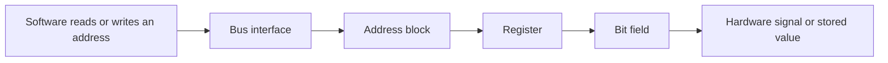
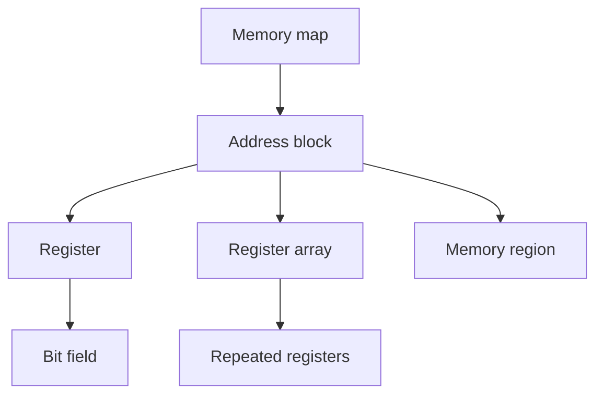
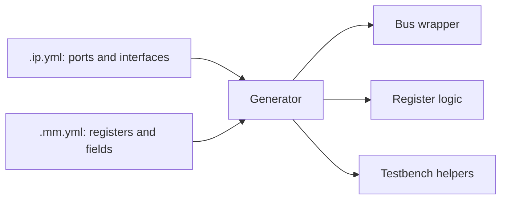
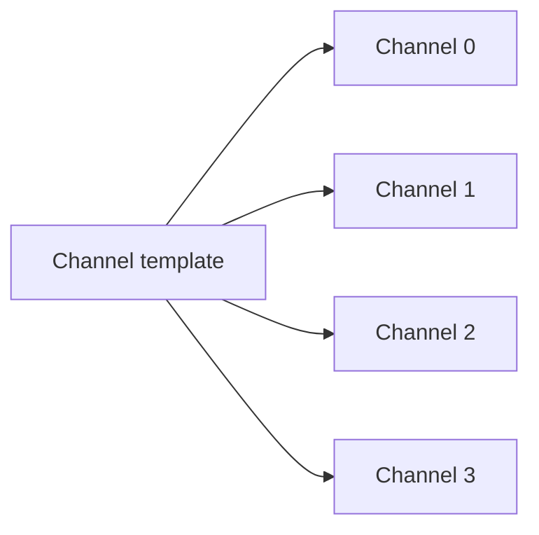

# Memory-Mapped Registers

This tutorial creates a small register map and explains how software-visible
registers become generated hardware.

You will define:

- one address block;
- a control register that software can write;
- a status register that software can read;
- an interrupt flag cleared by writing `1`.

## The basic idea

A processor reads and writes numbered addresses. The register map gives those
addresses names and divides each register into fields.



For example, software may write address `0x00` to enable a device and read
address `0x04` to check whether it is busy.

## Create the memory map

1. Open the Command Palette.
2. Run **IPCraft: New Register Map**.
3. Choose a file name such as `daq_controller.mm.yml`.
4. Open the file in the Memory Map editor.


The editor follows this hierarchy:



## Add an address block

An address block is a continuous address range served by one interface.

Create a block named `control` with:

| Property | Value | Meaning |
|---|---:|---|
| Base address | `0x0000` | First address in the block |
| Range | `0x1000` | Total reserved address space |
| Width | `32` | Bits transferred in one register word |
| Usage | `register` | The block contains registers |

The range can be larger than the registers currently defined. This leaves room
for later versions without moving existing addresses.

## Add a control register

Add a register named `CONTROL` at offset `0x00`. An offset is the register's
position relative to the block's base address.

Add these fields:

| Field | Bits | Software access | Reset | Purpose |
|---|---|---|---:|---|
| `ENABLE` | `0` | Read/write | `0` | Enable the device |
| `MODE` | `2:1` | Read/write | `0` | Select an operating mode |
| `START` | `3` | Write-only | `0` | Start one operation |

Bit ranges are written from the highest bit to the lowest bit. `2:1` therefore
covers two bits.

The remaining bits are unused. Gaps are valid and remain visible in the bit
field visualizer.

## Add a status register

Add `STATUS` at offset `0x04`:

| Field | Bits | Software access | Reset | Purpose |
|---|---|---|---:|---|
| `BUSY` | `0` | Read-only | `0` | Hardware is processing |
| `ERROR` | `1` | Read-only | `0` | Hardware detected an error |
| `IRQ_PENDING` | `2` | Read/write | `0` | Interrupt is waiting |

Set `IRQ_PENDING` to write-one-to-clear behavior. Software clears it by writing
a `1` to that bit. Writing `0` leaves it unchanged.

## Understand access types

Access describes what software may do. Hardware behavior is configured
separately.

| Access | Software can read | Software can write | Common use |
|---|---|---|---|
| Read-only | Yes | No | Status and counters |
| Write-only | No | Yes | Commands and triggers |
| Read/write | Yes | Yes | Configuration and control |

Special behavior modifies what a write or hardware event does:

### Write one to clear

Used for interrupt or error flags. Hardware sets the bit; software acknowledges
it by writing `1`.

```text
current value  software write  next value
      1              0              1
      1              1              0
```

### Self-clearing

Used for command bits such as `START`. Software writes `1`; generated logic
turns it back to `0` after the command has been observed.

### Change of state

Used when hardware should record that an input changed. Software can then read
or clear the recorded event.

Use special behavior only when it matches the hardware contract. A plain
read/write field is easier to understand and test.

## Link the map to an IP core

The memory map describes addresses and fields. The IP core describes ports,
parameters, clocks, resets, and bus interfaces. Link them so the generator can
connect the register map to a bus.



You can create both linked files at once with
**IPCraft: New IP Core + Register Map**, or add the memory-map reference to an
existing IP core.

## Resulting address map

With a block base of `0x0000`, the example becomes:

| Absolute address | Register | Important fields |
|---:|---|---|
| `0x0000` | `CONTROL` | `ENABLE`, `MODE`, `START` |
| `0x0004` | `STATUS` | `BUSY`, `ERROR`, `IRQ_PENDING` |

For a non-zero block base, add the register offset to that base.

## Generate and test

1. Save both YAML files.
2. Run **IPCraft: Scaffold Project**.
3. Review the staged file list.
4. Accept the generated files.
5. Compile the generated HDL.
6. Run the generated tests.

Generated tests should check reset values, valid reads and writes, read-only
behavior, and special fields such as write-one-to-clear.

## Advanced layouts

The rest of this page introduces structures to use after a simple map works.

### Register arrays

Use an array when the same register layout repeats, for example one control and
status pair per channel.



A group array repeats several registers together. A flat array repeats one
register. Choose a stride large enough for every item and any required address
alignment.

Prefer an array over manually copied registers. It makes the repeated structure
explicit and prevents small differences between channels.

### Memory regions

A memory region reserves an address span that is not described as individual
register fields, such as a buffer or on-chip RAM window.

Document its size, access, and alignment. Software still needs a clear contract
for the contents even though IPCraft does not describe every word as a register.

### Multiple address blocks

Use multiple blocks when interfaces or address spaces are genuinely separate.
Do not create another block only to group a few nearby registers; names and
descriptions are usually enough.

## Design checklist

Before generating hardware, confirm:

- register offsets are aligned to the data width;
- fields do not overlap or extend past the register width;
- reset values fit inside their fields;
- access types match the software and hardware responsibilities;
- special write behavior is documented;
- reserved address space leaves room for growth;
- arrays have an explicit count and stride;
- the IP core links to the intended memory map and bus interface.

## Next steps

- [Create your first IP core](../how-to/create-your-first-ip-core.md)
- [Generate a project](../how-to/generating-a-project.md)
- [Run Cocotb simulations](../how-to/run-cocotb-simulation.md)
- [Specification schemas](../reference/specification-schemas.md)
