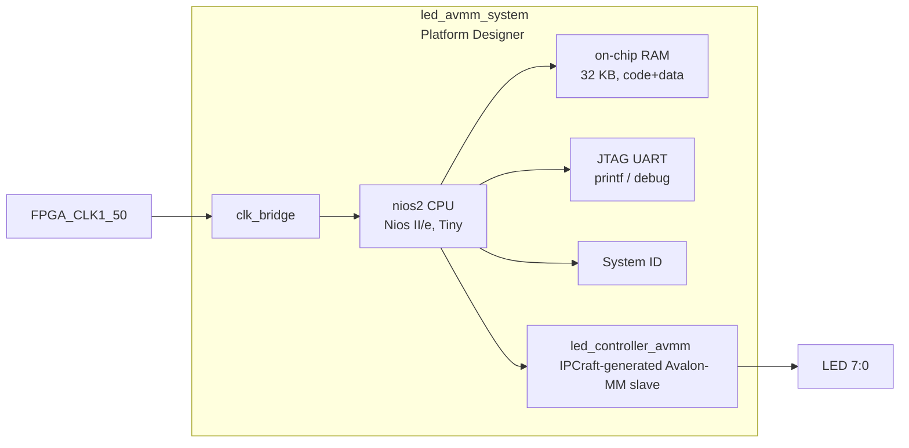
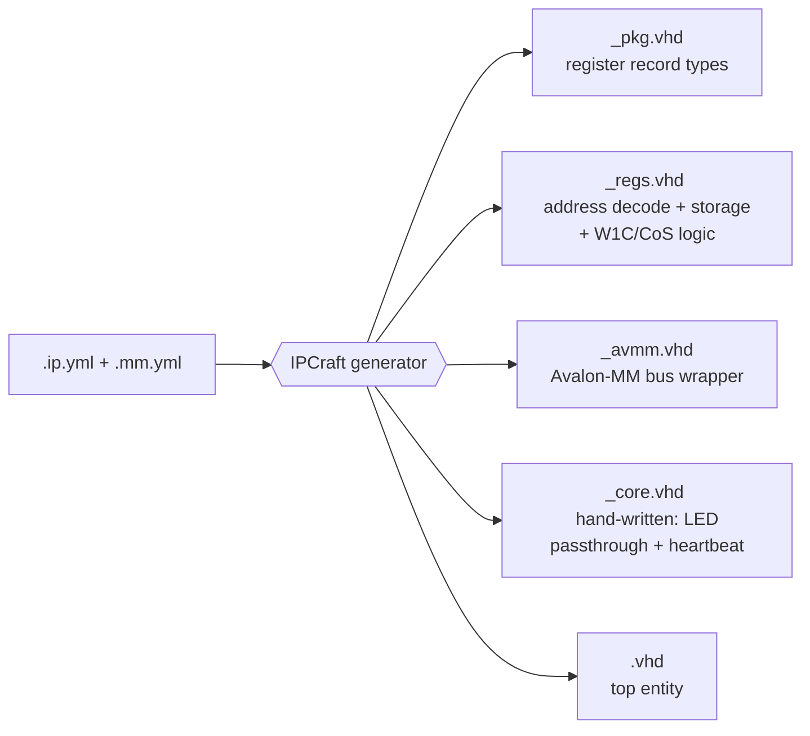

# 16 — IPCraft LED Controller (Avalon-MM)

This project builds the peripheral cvsoc's own roadmap called for and never
built: [`docs/roadmap.md`](../../docs/roadmap.md) Phase 2.2 asked for a custom
`led_controller_avmm.vhd` Avalon-MM slave with "one write register for LED
pattern, one read register for LED status," to be added to `common/ip/` for
reuse — but `04_nios2_led` shipped with the stock `altera_avalon_pio`
instead. This phase builds that exact component, generated end-to-end by
[IPCraft](https://github.com/bleviet/ipcraft-vscode) from a `.ip.yml`/`.mm.yml`
pair rather than hand-written VHDL, and reuses `04_nios2_led`'s Platform
Designer system as its base (stock LED PIO swapped for the generated
component).

This is also the first project in cvsoc with an HDL simulation testbench
(see `tb/`) — closing the gap `docs/review.md` calls out as cvsoc's #1 issue
("not a single testbench exists"). The full walkthrough of how this
peripheral was authored, simulated, and verified is written up as a tutorial
series in the [IPCraft](https://github.com/bleviet/ipcraft-vscode) repo's
`docs/tutorials/`.

## Architecture



`led_controller_avmm` itself is generated in layers by IPCraft
(`led_controller_avmm.ip.yml` + `.mm.yml` -> `IPCraft: Scaffold Project`):



Only `rtl/led_controller_avmm_core.vhd` is hand-written (marked
`managed: false` in the `.ip.yml`'s `fileSets`, so it survives a re-scaffold);
every other file under `rtl/`, `tb/`, and `altera/` is fully regenerated by
`IPCraft: Scaffold Project` from the two YAML files at the top of this
directory.

### Register map — `led_controller_avmm`

| Offset | Register | Access | Fields |
|--------|----------|--------|--------|
| `0x00` | VERSION | read-only | `MINOR[7:0]` (reset 0), `MAJOR[15:8]` (reset 1) |
| `0x04` | LED_PATTERN | read-write | `PATTERN[7:0]` — bit N drives `LED[N]` |
| `0x08` | EVENTS | read-write-1-to-clear | `HEARTBEAT_ACTIVE[0]` (read-only, toggles ~0.75 Hz), `HEARTBEAT_TOGGLED[1]` (write-1-to-clear, `monitorChangeOf: HEARTBEAT_ACTIVE`) |

`HEARTBEAT_ACTIVE` is a free-running divider inside `_core.vhd`, driven
purely in hardware — a liveness signal, not a readback of what software
wrote. `HEARTBEAT_TOGGLED`'s sticky-flag and write-1-to-clear logic is
generated entirely inside `_regs.vhd`; the core only drives the live level.

### Memory map (Nios II system)

| Peripheral              | Base address | Size  |
|-------------------------|-------------|-------|
| On-chip RAM (code+data) | `0x00000000` | 32 KB |
| led_controller_avmm     | `0x00010010` | 16 B  |
| JTAG UART               | `0x00010100` | 8 B   |
| System ID               | `0x00010108` | 8 B   |
| Nios II debug slave     | `0x00010800` | 2 KB  |

## Directory structure

```
16_ipcraft_led_avmm/
├── docs/
│   ├── README.md                        ← this file
│   ├── hardware_debug_process.md
│   ├── led_controller_avmm_registers.md
│   └── systemconsole_implementation_plan.md  ← System Console plan for ipcraft-vscode #36
├── led_controller_avmm.ip.yml       ← hand-authored IPCraft spec
├── led_controller_avmm.mm.yml       ← hand-authored register map
├── rtl/                             ← IPCraft-generated (core.vhd hand-edited)
│   ├── led_controller_avmm_pkg.vhd
│   ├── led_controller_avmm_regs.vhd
│   ├── led_controller_avmm_core.vhd     ← user-owned: LED passthrough + heartbeat
│   ├── led_controller_avmm_avmm.vhd
│   └── led_controller_avmm.vhd
├── tb/                              ← IPCraft-generated cocotb testbench
├── altera/                          ← IPCraft-generated standalone IP-core Quartus project
│   ├── led_controller_avmm_hw.tcl       ← Platform Designer component descriptor
│   ├── led_controller_avmm_project.tcl
│   ├── led_controller_avmm.sdc
│   └── test.qsys                        ← minimal BFM validation system
├── debug/                           ← System Console register debug (issue #36)
│   ├── README.md                        ← debug usage + architecture
│   ├── read_all_registers.tcl           ← Tcl: read all registers via JTAG master
│   ├── write_led_pattern.tcl            ← Tcl: write LED_PATTERN + verify
│   └── debug_console.py                 ← Python transport + driver (sentinel-framed)
├── hdl/
│   └── de10_nano_top.vhd            ← VHDL top-level wrapper
├── qsys/
│   ├── led_avmm_system.tcl          ← Platform Designer system script (qsys-script input)
│   ├── led_avmm_system_debug.tcl    ← debug variant: adds JTAG-to-Avalon-MM master
│   └── led_controller_avmm_hw.tcl   ← symlink -> ../altera/led_controller_avmm_hw.tcl
├── quartus/
│   ├── Makefile                     ← full build orchestrator (incl. debug-* targets)
│   ├── de10_nano_project.tcl
│   ├── de10_nano_pin_assignments.tcl
│   └── de10_nano.sdc
└── software/
    ├── bsp/                         ← generated by nios2-bsp (not committed)
    └── app/
        ├── Makefile
        └── main.c
```

The `qsys/led_controller_avmm_hw.tcl` symlink exists so `qsys-script` finds
the custom component descriptor in its own working directory, the same way
`15_ddr3_fpga_hps` co-locates `ddr3_test_master_hw.tcl` directly next to
`hps_system.tcl` — see "Regenerating the IPCraft RTL" below for why this
matters when re-running the scaffold.

## Regenerating the IPCraft RTL

`rtl/`, `tb/`, and `altera/` are fully reproducible from the two YAML files
via IPCraft's **Scaffold Project** command (or `IpCoreScaffolder.generateAll`
directly), pointed at this directory as the output root:

```bash
# From the ipcraft-vscode repo, or via the "IPCraft: Scaffold Project" command
# targeting cvsoc/16_ipcraft_led_avmm/led_controller_avmm.ip.yml
```

`rtl/led_controller_avmm_core.vhd` and `tb/led_controller_avmm_test.py` are
marked `managed: false` in `led_controller_avmm.ip.yml`'s `fileSets`, so a
re-scaffold never overwrites the hand-written heartbeat/passthrough logic or
the hand-added cocotb assertions.

## How to Build (fully scripted)

All steps are driven from the command line inside the `cvsoc/quartus:23.1`
Docker image (or an equivalent native Quartus + Nios II EDS + Platform
Designer install — this project was validated against a native Quartus
25.1std install). No GUI tool is required.

```bash
docker run --rm \
  -v /path/to/cvsoc:/work \
  cvsoc/quartus:23.1 \
  bash -c "cd /work/16_ipcraft_led_avmm/quartus && make all"
```

The `make all` target runs in order:

| Step | Make target | Tool              | Output                           |
|------|-------------|-------------------|-----------------------------------|
| 1    | `qsys`      | `qsys-script`     | `qsys/led_avmm_system.qsys`       |
| 1b   |             | `qsys-generate`   | `qsys/led_avmm_system_gen/` (VHDL) |
| 2    | `project`   | `quartus_sh -t`   | `.qpf`, `.qsf`                    |
| 3    | `compile`   | `quartus_sh --flow compile` | `.sof` bitstream        |
| 4    | `bsp`       | `nios2-bsp`       | `software/bsp/` HAL BSP           |
| 5    | `app`       | `nios2-elf-gcc`   | `software/app/led_avmm_demo.elf`  |

### Running individual steps

```bash
# Regenerate Platform Designer system only
make qsys

# FPGA compile only (assumes qsys already generated)
make project compile

# Regenerate BSP after hardware changes
make bsp

# Rebuild application only
make -C ../software/app
```

## Headless IP-core timing verification

Independent of the board-level `quartus/` project above, IPCraft's generated
`altera/` directory is a standalone, pin-less Quartus project
(`VIRTUAL_PIN ON -to *`) for verifying the `led_controller_avmm` component's
timing and resource usage in isolation:

```bash
cd altera
quartus_sh -t led_controller_avmm_project.tcl
quartus_sh --flow compile led_controller_avmm
```

Verified on a native Quartus 25.1std install (Cyclone V, `5CSEBA6U23I7`):

| Metric | Result |
|--------|--------|
| Logic utilization | 77 ALMs / 41,910 (< 1%) |
| Registers | 45 |
| Worst-case setup slack | +16.99 ns (Slow 1100mV -40C) |
| Worst-case hold slack | +0.12 ns (Fast 1100mV -40C) |
| Worst-case pulse-width slack | +9.18 ns |

All four corner models (Slow/Fast × 100C/-40C) show positive slack — timing
met cleanly for a 3-register peripheral at 50 MHz, as expected.

## Firmware

`software/app/main.c` cycles LED patterns and validates `VERSION` once at
startup.
Unlike the stock `altera_avalon_pio` used in `04_nios2_led`, a hand-written
Platform Designer component doesn't get an auto-generated HAL macro header,
so registers are accessed directly by offset (see `led_controller_avmm.mm.yml`
for the address map):

```c
IOWR_32DIRECT(LED_CTRL_BASE, 4, pattern);        // LED_PATTERN
uint32_t version = IORD_32DIRECT(LED_CTRL_BASE, 0); // VERSION
```

## Programming the board

IPCraft's pipeline stops at the timing/utilization report above — there is
no bitstream-generation or board-programming step in the extension itself.
From here on, every step is cvsoc's own existing manual/scripted flow
(`quartus_pgm`/`nios2-download`/`nios2-terminal`), the same as every other
Nios II phase in this repo, requiring physical DE10-Nano + USB-Blaster
access.

## System Console register debug (without Nios II firmware)

This project also includes a **debug variant** of the Platform Designer
system (`qsys/led_avmm_system_debug.tcl`) that adds an
`altera_jtag_avalon_master` — a JTAG-to-Avalon-MM bridge — connected to
`led_ctrl.S_AVMM`. This allows reading and writing registers directly via
Altera System Console over JTAG, **without downloading any Nios II
firmware**.

This is the hardware validation for
[ipcraft-vscode issue #36](https://github.com/bleviet/ipcraft-vscode/issues/36),
which proposes a `SystemConsoleTransport` in the VS Code extension's Memory
Map editor Debug Mode. The full implementation plan is in
[`docs/systemconsole_implementation_plan.md`](systemconsole_implementation_plan.md).

```bash
cd quartus

# Build the debug variant (adds JTAG-to-Avalon-MM master)
make debug-build

# Program the FPGA
make debug-program

# Read all registers via System Console Tcl
make debug-read-all

# Write LED_PATTERN = 0xFF and verify readback
make debug-write-led VALUE=0xFF

# Python debug console: full register dump with field decode
make debug-dump

# Poll EVENTS register (watch the heartbeat toggle)
make debug-poll REG=EVENTS COUNT=20 INTERVAL=0.5
```

See [`debug/README.md`](../debug/README.md) for the architecture diagram and
direct Python/Tcl usage.

After a successful `make all` (real board project in `quartus/`, distinct
from the virtual-pin `altera/` project used for timing verification above):

```bash
# Program SRAM configuration (not persistent)
quartus_pgm -m jtag -o "p;output_files/16_ipcraft_led_avmm.sof"

# Download software
nios2-download -g software/app/led_avmm_demo.elf

# Open JTAG terminal (printf output)
nios2-terminal
```

### What to expect

- **LEDs**: the same cycling pattern sequence as `04_nios2_led`, now driven
  by an IPCraft-generated register file instead of the stock
  `altera_avalon_pio`.
- **Version-mismatch fail-safe**: if `VERSION` is wrong, firmware drives a
  persistent `0xAA/0x55` error pattern instead of attempting the normal
  animation.
- **JTAG terminal is optional**: firmware does not rely on UART output for
  visible LED behavior.

## Notes and gotchas found while building this

- **A real IPCraft template bug was found and fixed while building this
  peripheral**: `bus_avmm.vhdl.j2` guarded its Avalon-MM port-list block with
  `` — Nunjucks treats an empty array as truthy (JS
  semantics, unlike Jinja2/Python), so an Avalon-MM slave with no
  `useOptionalPorts` specified produced invalid VHDL (a bare `;` in the
  entity's port list). Fixed upstream in ipcraft-vscode with a regression
  test. Every port in `avalon_mm.yml`'s bus definition is `presence:
  optional` — even `address`/`read`/`write` — so `useOptionalPorts` must be
  listed explicitly for a functional slave.
- **Keep the Avalon-MM metadata and RTL in sync.** `S_AVMM` is configured as
  `addressUnits WORDS` with a 2-bit `avs_address` port, and
  `led_controller_avmm_avmm.vhd` reconstructs byte offsets internally via
  `address <= avs_address & "00"`. Mismatching this contract between
  `led_controller_avmm_hw.tcl`/`.ip.yml` and RTL breaks hardware behavior.
- The `qsys/led_controller_avmm_hw.tcl` symlink was validated end-to-end on
  a real Platform Designer install (Quartus 25.1std, native, no Docker):
  `add_instance led_ctrl led_controller_avmm` inside a hand-written system
  script, and `qsys-generate --synthesis=VHDL` against the IPCraft-generated
  `test.qsys`, both succeeded with zero errors related to the component.
- That same validation surfaced an unrelated finding: `altera_nios2_gen2` is
  not available in the Quartus 25.1std IP catalog on that workstation ("No
  module type named altera_nios2_gen2") — likely dropped in favor of Nios V
  in newer Quartus Prime versions. This affects every cvsoc Nios II phase
  built there, not just this one; the `cvsoc/quartus:23.1` Docker image (or
  an older native install) is required for Nios II Gen2-based builds.
- **Adding real cocotb assertions (see `tb/led_controller_avmm_test.py`)
  surfaced four more real, previously invisible IPCraft bugs**, all fixed
  upstream with regression tests — full story in
  [Part 2 of the tutorial series](https://github.com/bleviet/ipcraft-vscode/blob/main/docs/tutorials/led-controller-avmm-simulation.md):
  1. `mm_loader.py.j2` read snake_case `address_blocks`/`base_address`
     instead of the schema's camelCase `addressBlocks`/`baseAddress` —
     `load_regmap()` silently returned an empty register list for *every*
     IPCraft-generated cocotb test in existence.
  2. `_parse_bits` never stripped the schema's literal `[`/`]` from
     `bits: '[7:0]'` — it had never successfully parsed a single real bit
     field.
  3. `cocotb_test.py.j2`'s Avalon-MM helpers shifted addresses by `>> 2`
     (word-indexed assumption); the generated register file decodes raw
     byte offsets with no shift.
  4. The generated `_read_reg` sampled `readdata` one cycle too early for a
     fixed-latency slave (no `readdatavalid`) — every read returned the
     *previous* bus access's result.

  All four were invisible because the generated cocotb test only logs
  read-back values — it never asserts on them.
- **The headless Quartus build (see above) surfaced two more real IPCraft
  bugs in the Quartus scaffold pack**, both fixed upstream:
  1. `quartus_sdc.j2`'s clock-comment line used an inline Jinja
     `...` whose trailing newline was consumed by
     `trimBlocks: true` (this repo's own documented template gotcha) — the
     following `create_clock ...` line was silently merged into the
     preceding Tcl comment and never actually applied. First-run timing
     analysis reported "Design is not fully constrained" and negative slack.
  2. Even after that fix, `quartus_project.tcl.j2` wrapped `SDC_FILE` in the
     same `[file join .. ...]` used for `rtl_files`, but the `.sdc` is
     written as a sibling of `project.tcl` in `altera/` (RTL files live one
     level up in `../rtl/`) — the extra `..` made Quartus report
     "Synopsys Design Constraints File file not found". Fixed by referencing
     the bare filename.

  Both were confirmed on the real Quartus 25.1std run recorded above:
  before the fixes, worst-case setup slack was **-1.807 ns** (timing not
  met); after, **+16.99 ns** across every corner model.

## Concepts covered

- Authoring an Avalon-MM peripheral from `.ip.yml`/`.mm.yml` instead of
  hand-written VHDL
- IPCraft's layered generation: package, register file, bus wrapper, core
  stub, top entity
- `write-1-to-clear` + `monitorChangeOf` (change-of-state) register semantics
- Protecting hand-written files from re-scaffold overwrite (`fileSets`,
  `managed: false`)
- Platform Designer (Qsys) system integration of a generated custom component
- Fully script-driven FPGA + embedded software build flow
