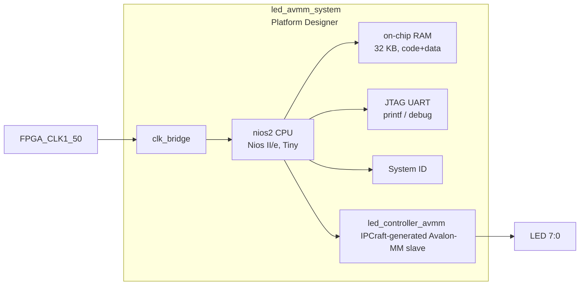
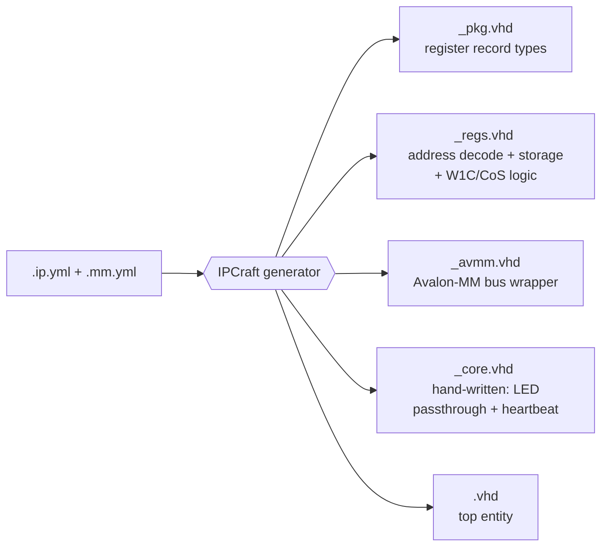

# led_avmm -- IPCraft LED Controller (Avalon-MM)

This example builds a small Avalon-MM peripheral end-to-end with
[IPCraft](https://github.com/bleviet/ipcraft-vscode): "one write register for
LED pattern, one read register for LED status," generated from a
`.ip.yml`/`.mm.yml` pair rather than hand-written VHDL, integrated into a
Platform Designer Nios II system, and validated on a real DE10-Nano board.

It is also the reference example for this repository's hardware bring-up
process: build, simulate, integrate with Platform Designer, compile with
Quartus, program the board, and validate over JTAG.
`regmap_conformance_avmm/` and `regmap_conformance_axil/` follow the same
shape.

## Architecture


```mermaid
flowchart LR
    CLK[FPGA_CLK1_50] --> CLK_BRIDGE[clk_bridge]

    subgraph led_avmm_system [led_avmm_system <br/> Platform Designer]
        direction LR
        CLK_BRIDGE --> CPU[nios2 CPU <br/> Nios II/e, Tiny]
        CPU --> RAM[on-chip RAM <br/> 32 KB, code+data]
        CPU --> UART[JTAG UART <br/> printf / debug]
        CPU --> SYSID[System ID]
        CPU --> LEDCTRL[led_controller_avmm <br/> IPCraft-generated Avalon-MM slave]
    end

    LEDCTRL --> LED_OUT[LED 7:0]
```

`led_controller_avmm` itself is generated in layers by IPCraft
(`led_controller_avmm.ip.yml` + `.mm.yml` -> `IPCraft: Scaffold Project`):


```mermaid
flowchart LR
    IP[".ip.yml + .mm.yml"] --> GEN{{IPCraft generator}}
    GEN --> PKG[_pkg.vhd <br/> register record types]
    GEN --> REGS[_regs.vhd <br/> address decode + storage + W1C/CoS logic]
    GEN --> AVMM[_avmm.vhd <br/> Avalon-MM bus wrapper]
    GEN --> CORE[_core.vhd <br/> hand-written: LED passthrough + heartbeat]
    GEN --> TOP[.vhd <br/> top entity]
```

The scaffold owns the generated register RTL, bus wrapper, top entity,
component descriptor, and test support files.
`rtl/led_controller_avmm_core.vhd`,
`tb/led_controller_avmm_test.py`, and
`tb/test_led_controller_avmm_sim.py` are marked `managed: false` in the
`.ip.yml` file sets and remain user-owned across a re-scaffold. The
board-level Platform Designer, Quartus, firmware, and debug files are also
maintained as part of this example rather than regenerated from the two YAML
files.

### Register map -- `led_controller_avmm`

| Offset | Register | Access | Fields |
|--------|----------|--------|--------|
| `0x00` | VERSION | read-only | `MINOR[7:0]` (reset 0), `MAJOR[15:8]` (reset 1) |
| `0x04` | LED_PATTERN | read-write | `PATTERN[7:0]` -- bit N drives `LED[N]` |
| `0x08` | EVENTS | read-write-1-to-clear | `HEARTBEAT_ACTIVE[0]` (read-only, toggles ~0.75 Hz), `HEARTBEAT_TOGGLED[1]` (write-1-to-clear, `monitorChangeOf: HEARTBEAT_ACTIVE`) |

`HEARTBEAT_ACTIVE` is a free-running divider inside `_core.vhd`, driven
purely in hardware -- a liveness signal, not a readback of what software
wrote. `HEARTBEAT_TOGGLED`'s sticky-flag and write-1-to-clear logic is
generated entirely inside `_regs.vhd`; the core only drives the live level.

### Memory map (Nios II system)

| Peripheral              | Base address | Size  |
|-------------------------|-------------|-------|
| On-chip RAM (code+data) | `0x00000000` | 32 KB |
| led_controller_avmm     | `0x00010010` | 16 B  |
| JTAG UART               | `0x00010100` | 8 B   |
| System ID               | `0x00010108` | 8 B   |
| Nios II debug slave     | `0x00010800` | 2 KB  |

## Directory structure

```
led_avmm/
├── docs/
│   ├── README.md                        <- this file
│   ├── hardware_troubleshooting.md
│   ├── led_controller_avmm_registers.md
│   └── system_console_debug.md
├── led_controller_avmm.ip.yml       <- hand-authored IPCraft spec
├── led_controller_avmm.mm.yml       <- hand-authored register map
├── rtl/                             <- IPCraft-generated (core.vhd hand-edited)
│   ├── led_controller_avmm_pkg.vhd
│   ├── led_controller_avmm_regs.vhd
│   ├── led_controller_avmm_core.vhd     <- user-owned: LED passthrough + heartbeat
│   ├── led_controller_avmm_avmm.vhd
│   └── led_controller_avmm.vhd
├── tb/                               <- IPCraft-generated cocotb testbench
├── software/
│   ├── app/                          <- portable LED demo logic (HAL-only)
│   │   ├── led_demo.h
│   │   └── led_demo.c
│   └── platform/nios2/               <- Nios II HAL + BSP glue
│       ├── main.c
│       ├── platform.c
│       └── Makefile
└── altera/                           <- all Quartus/Platform Designer tooling
    ├── led_controller_avmm_hw.tcl        <- Platform Designer component descriptor
    ├── led_controller_avmm_project.tcl
    ├── led_controller_avmm.sdc
    ├── hdl/
    │   └── de10_nano_top.vhd             <- VHDL top-level wrapper
    ├── qsys/
    │   ├── led_avmm_system.tcl           <- Platform Designer system script (qsys-script input)
    │   ├── led_avmm_system_debug.tcl     <- debug variant: adds JTAG-to-Avalon-MM master
    │   └── led_controller_avmm_hw.tcl    <- symlink -> ../led_controller_avmm_hw.tcl
    ├── quartus/
    │   ├── Makefile                      <- full build orchestrator (incl. debug-* targets)
    │   ├── de10_nano_project.tcl
    │   ├── de10_nano_pin_assignments.tcl
    │   └── de10_nano.sdc
    └── debug/
        ├── README.md                     <- debug usage + architecture
        ├── read_all_registers.tcl        <- Tcl: read all registers via JTAG master
        ├── write_led_pattern.tcl         <- Tcl: write LED_PATTERN + verify
        └── debug_console.py              <- Python transport + driver (sentinel-framed)
```

The `altera/qsys/led_controller_avmm_hw.tcl` symlink exists so `qsys-script`
finds the custom component descriptor in its own working directory -- see
"Regenerating the IPCraft RTL" below for why this matters when re-running the
scaffold.

## Regenerating the IPCraft RTL

The generated files in `rtl/`, `tb/`, and `altera/` can be refreshed from the
two YAML files via IPCraft's **Scaffold Project** command (or
`IpCoreScaffolder.generateAll` directly), pointed at this directory as the
output root:

```bash
# From the ipcraft-vscode repo, or via the "IPCraft: Scaffold Project" command
# targeting examples/led_avmm/led_controller_avmm.ip.yml
```

The three `managed: false` files listed above are not overwritten. This
preserves the hand-written heartbeat/passthrough logic, cocotb assertions,
and simulation wrapper.

The generator assumes vendor integration files sit one level below the IP
root (`rtl/` as a sibling of the vendor folder); because this example nests
Quartus/Platform Designer tooling one level deeper, under
`altera/quartus/` and `altera/qsys/`, regenerating
`altera/led_controller_avmm_hw.tcl` resets its `PATH ../rtl/...` fileset
entries -- re-run `sed -i 's#PATH \.\./rtl/#PATH ../../rtl/#g' altera/led_controller_avmm_hw.tcl`
afterward.

## How to Build (fully scripted)

All steps are driven from the command line inside the
`ipcraft-examples/quartus:23.1` Docker image (or an equivalent native Quartus
+ Nios II EDS + Platform Designer install -- this project was validated
against a native Quartus 25.1std install). No GUI tool is required.

```bash
cd altera/quartus
make all
```

`REPO_ROOT` in the Makefile resolves to `examples/` (not the whole repo), so
Docker only ever mounts this examples tree plus `examples/common/`; every
`make` target invokes Docker automatically, so these commands also work
called directly from the host.

The `all` target runs in order:

| Step | Make target | Tool              | Output                           |
|------|-------------|-------------------|-----------------------------------|
| 1    | `qsys`      | `qsys-script`     | `qsys/led_avmm_system.qsys`       |
| 1b   |             | `qsys-generate`   | `qsys/led_avmm_system_gen/` (VHDL) |
| 2    | `project`   | `quartus_sh -t`   | `.qpf`, `.qsf`                    |
| 3    | `compile`   | `quartus_sh --flow compile` | `.sof` bitstream        |
| 4    | `bsp`       | `nios2-bsp-create-settings` | `software/platform/nios2/bsp/` HAL BSP |
| 5    | `app`       | `nios2-elf-gcc`   | `software/platform/nios2/led_avmm_demo.elf` |

### Running individual steps

```bash
# cocotb pre-hardware gate (no vendor tools needed)
make sim

# Regenerate Platform Designer system only
make qsys

# FPGA compile only (assumes qsys already generated)
make project compile

# Regenerate BSP after hardware changes
make bsp

# Rebuild application only
make app
```

## Headless IP-core timing verification

Independent of the board-level `altera/quartus/` project above, IPCraft's
generated `altera/` directory is also a standalone, pin-less Quartus project
(`VIRTUAL_PIN ON -to *`) for verifying the `led_controller_avmm` component's
timing and resource usage in isolation:

```bash
cd altera
quartus_sh -t led_controller_avmm_project.tcl
quartus_sh --flow compile led_controller_avmm
```

Verified on a native Quartus 25.1std install (Cyclone V, `5CSEBA6U23I7`):

| Metric | Result |
|--------|--------|
| Logic utilization | 77 ALMs / 41,910 (< 1%) |
| Registers | 45 |
| Worst-case setup slack | +16.99 ns (Slow 1100mV -40C) |
| Worst-case hold slack | +0.12 ns (Fast 1100mV -40C) |
| Worst-case pulse-width slack | +9.18 ns |

All four corner models (Slow/Fast x 100C/-40C) show positive slack -- timing
met cleanly for a 3-register peripheral at 50 MHz, as expected.

## Firmware

`software/app/led_demo.c` cycles LED patterns and validates `VERSION` once at
startup, written only against the portable HAL in `led_demo.h`
(`platform_reg_read`/`platform_reg_write`/`platform_delay_ms`). A hand-written
Platform Designer component doesn't get an auto-generated HAL macro header,
so `software/platform/nios2/platform.c` implements that HAL by accessing
registers directly by offset (see `led_controller_avmm.mm.yml` for the
address map):

```c
IOWR_32DIRECT(LED_CTRL_BASE, 4, pattern);        // LED_PATTERN
uint32_t version = IORD_32DIRECT(LED_CTRL_BASE, 0); // VERSION
```

Porting this demo to a different CPU means adding a new
`software/platform/<cpu>/` directory that implements the same HAL --
`led_demo.c` itself does not change.

## Programming the board

IPCraft's pipeline stops at the timing/utilization report above -- there is
no bitstream-generation or board-programming step in the extension itself.
From here on, `altera/quartus/Makefile`'s `program-sof`/`download-elf`/
`terminal` targets drive `quartus_pgm`/`nios2-download`/`nios2-terminal` over
JTAG, requiring physical DE10-Nano + USB-Blaster access.

```bash
cd altera/quartus

make program-sof    # program the FPGA bitstream via JTAG
make download-elf    # download the Nios II ELF and start it
make terminal         # open the JTAG UART terminal (Ctrl-C to quit)
```

### What to expect

- **LEDs**: a repeating cycling pattern, driven by an IPCraft-generated
  register file.
- **Version-mismatch fail-safe**: if `VERSION` is wrong, firmware drives a
  persistent `0xAA/0x55` error pattern instead of attempting the normal
  animation.
- **JTAG terminal is optional**: firmware does not rely on UART output for
  visible LED behavior.

## System Console register debug (without Nios II firmware)

This project also includes a **debug variant** of the Platform Designer
system (`altera/qsys/led_avmm_system_debug.tcl`) that adds an
`altera_jtag_avalon_master` -- a JTAG-to-Avalon-MM bridge -- connected to
`led_ctrl.S_AVMM`. This allows reading and writing registers directly via
Altera System Console over JTAG, **without downloading any Nios II
firmware**.

The included Tcl scripts and Python console provide direct register access and
field decoding. The full design walkthrough is in
[`docs/system_console_debug.md`](system_console_debug.md).

```bash
cd altera/quartus

# Build the debug variant (adds JTAG-to-Avalon-MM master)
make debug-build

# Program the FPGA
make debug-program

# Read all registers via System Console Tcl
make debug-read-all

# Write LED_PATTERN = 0xFF and verify readback
make debug-write-led VALUE=0xFF

# Python debug console: full register dump with field decode
make debug-dump

# Poll EVENTS register (watch the heartbeat toggle)
make debug-poll REG=EVENTS COUNT=20 INTERVAL=0.5
```

See [`altera/debug/README.md`](../altera/debug/README.md) for the
architecture diagram and direct Python/Tcl usage.

## Implementation constraints

- **Declare the required Avalon-MM ports explicitly.** Every port in the
  `avalon_mm.yml` bus definition has `presence: optional`, including
  `address`, `read`, and `write`. A functional slave therefore lists its
  required ports in `useOptionalPorts`.
- **Keep Avalon-MM metadata and RTL consistent.** `S_AVMM` uses
  `addressUnits WORDS` and a 2-bit `avs_address` port. The wrapper converts
  the word address to a byte offset with `address <= avs_address & "00"`.
- **Use byte offsets in cocotb bus operations.** The generated register file
  decodes byte offsets. Fixed-latency reads without `readdatavalid` must wait
  for the configured read latency before sampling `readdata`.
- **Preserve the component descriptor symlink.**
  `altera/qsys/led_controller_avmm_hw.tcl` points to the descriptor in the
  parent directory so `qsys-script` can discover the custom component from
  its working directory.
- **Use a Quartus release that contains Nios II Gen2.** The board system
  instantiates `altera_nios2_gen2`. The provided
  `ipcraft-examples/quartus:23.1` image contains that IP; Quartus installations
  without it cannot build this board-level design.
- **Keep the SDC beside the generated Quartus project Tcl.** The project
  references the SDC by filename, while RTL paths are relative to `../rtl`.
  The SDC clock constraint must remain on its own Tcl line so Quartus applies
  the 50 MHz constraint.

## Concepts covered

- Authoring an Avalon-MM peripheral from `.ip.yml`/`.mm.yml` instead of
  hand-written VHDL
- IPCraft's layered generation: package, register file, bus wrapper, core
  stub, top entity
- `write-1-to-clear` + `monitorChangeOf` (change-of-state) register semantics
- Protecting hand-written files from re-scaffold overwrite (`fileSets`,
  `managed: false`)
- Platform Designer (Qsys) system integration of a generated custom component
- Fully script-driven FPGA + embedded software build flow
