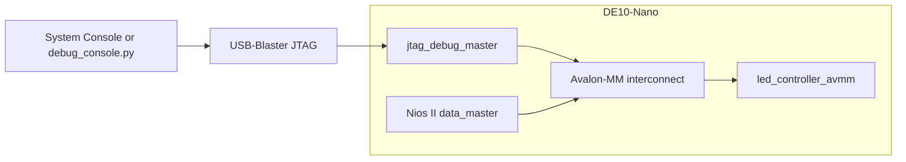

# System Console Register Debug

The `led_avmm` example includes a debug variant of the DE10-Nano design that
provides direct register access through Altera System Console. It does not
require Nios II firmware to read or write the LED controller.

This document describes the implementation present in this example.

## Architecture



`altera/qsys/led_avmm_system_debug.tcl` adds
`altera_jtag_avalon_master` as a second Avalon-MM master. Platform Designer
provides arbitration between this master and the Nios II data master.

The debug master also connects to on-chip memory and System ID for bring-up
diagnostics. Direct LED register access only requires its connection to
`led_ctrl.S_AVMM`.

## Implemented artifacts

| Path                                    | Purpose                                                               |
| --------------------------------------- | --------------------------------------------------------------------- |
| `altera/qsys/led_avmm_system_debug.tcl` | Defines the board system with the JTAG-to-Avalon-MM master            |
| `altera/debug/read_all_registers.tcl`   | Reads and decodes all LED controller registers                        |
| `altera/debug/write_led_pattern.tcl`    | Writes `LED_PATTERN` and verifies readback                            |
| `altera/debug/debug_console.py`         | Loads the memory map and provides named register and field operations |
| `altera/quartus/Makefile`               | Provides the `debug-*` build, program, and access targets             |

The VS Code extension does not currently expose this transport as a live
Memory Map editor connection. The executable implementation in this example
is the Tcl and Python tooling listed above.

## Addressing

The `.mm.yml` file describes offsets relative to the IP. Platform Designer
places the IP at `0x00010010`, as configured in
`led_avmm_system_debug.tcl`.

| Register      | Offset | System Console byte address | Access                      |
| ------------- | ------ | --------------------------- | --------------------------- |
| `VERSION`     | `0x00` | `0x00010010`                | Read-only                   |
| `LED_PATTERN` | `0x04` | `0x00010014`                | Read-write                  |
| `EVENTS`      | `0x08` | `0x00010018`                | Read and write-one-to-clear |

System Console's `master_read_32` and `master_write_32` commands use byte
addresses. The component interface uses word-addressed Avalon-MM, and the
wrapper reconstructs byte offsets with:

```vhdl
address <= avs_address & "00";
```

Host tools therefore use `SoC base + .mm.yml offset` without shifting the
address.

## Build and use

Run the commands from `examples/led_avmm/altera/quartus`:

```bash
make debug-build
make debug-program
make debug-read-all
make debug-write-led VALUE=0xFF
make debug-dump
make debug-poll REG=EVENTS COUNT=20 INTERVAL=0.5
```

The targets use the Quartus Docker image with USB passthrough. A native
Quartus installation can run the Tcl and Python tools directly.

### Expected register values

Immediately after reset:

| Register      | Expected value                                         |
| ------------- | ------------------------------------------------------ |
| `VERSION`     | `0x00000100`                                           |
| `LED_PATTERN` | `0x00000000`                                           |
| `EVENTS`      | Initially zero; heartbeat bits change during operation |

`make debug-write-led VALUE=0xFF` lights all eight LEDs and verifies that the
register reads back as `0xFF`.

## Direct Tcl usage

From `examples/led_avmm/altera`:

```bash
system-console --cli --script=debug/read_all_registers.tcl
system-console --cli --script=debug/write_led_pattern.tcl
```

The scripts:

1. Discover the master with `get_service_paths master`.
2. Open it with `open_service master <path>`.
3. Execute `master_read_32` or `master_write_32`.
4. Close it with `close_service master <path>`.

JTAG service paths contain Tcl metacharacters, so generated Tcl commands must
brace the path before passing it to `open_service`.

## Python console

`altera/debug/debug_console.py` parses
`led_controller_avmm.mm.yml` and binds the register model to a System Console
transport.

From `examples/led_avmm/altera`:

```bash
# Inspect the memory map without hardware
python3 debug/debug_console.py list

# Read or write by register name
python3 debug/debug_console.py --base 0x00010010 read VERSION
python3 debug/debug_console.py --base 0x00010010 write LED_PATTERN 0xFF

# Perform a field-level read-modify-write
python3 debug/debug_console.py \
  --base 0x00010010 \
  write-field LED_PATTERN PATTERN 0x55

# Decode all registers or poll one register
python3 debug/debug_console.py --base 0x00010010 dump
python3 debug/debug_console.py --base 0x00010010 poll EVENTS 20 0.5
```

The Python transport starts one short-lived `system-console --cli` process per
transaction. Each process sources a temporary Tcl file and emits markers such
as `@@VAL`, `@@WROTE`, `@@ERROR`, and `@@END`. This avoids parsing wrapped
interactive command echoes and ensures that JTAG services are rediscovered for
each transaction.

## Operational constraints

### Debug bitstream required

System Console can see a master service only when the programmed bitstream
contains `jtag_debug_master`. Use `debug-build` and `debug-program`; the normal
board bitstream does not expose this service.

### Explicit SoC base required

The memory map alone cannot determine where a peripheral is placed in a
board-level system. Pass `--base 0x00010010` to the Python console. If the
Platform Designer address changes, update the host command accordingly.

### Exclusive JTAG access

The USB-Blaster may be unavailable while another `jtagd`, Nios II terminal, or
debugger owns it. Stop the specific conflicting process before starting a
debug target.

### JTAG startup delay

`jtagd` needs time to initialize before System Console discovers services.
The Makefile's debug targets wait five seconds before invoking the console.

### Host or USB-passthrough execution

Direct hardware access requires a Quartus installation with access to the
USB-Blaster. The provided Docker targets use `--privileged` and mount
`/dev/bus/usb`; without USB passthrough, run the tools on a configured host.

## Validation checks

Use the following checks after changing the fabric, address map, register
model, or console tooling:

| Check              | Command                           | Expected result                                |
| ------------------ | --------------------------------- | ---------------------------------------------- |
| Build debug design | `make debug-build`                | Quartus compile succeeds and timing is met     |
| Program board      | `make debug-program`              | FPGA configuration succeeds                    |
| Read register map  | `make debug-read-all`             | `VERSION=0x100`; all three registers decode    |
| Write register     | `make debug-write-led VALUE=0xFF` | Readback is `0xFF`; all LEDs light             |
| Decode fields      | `make debug-dump`                 | Three registers and their fields are shown     |
| Field write        | Python `write-field` command      | `PATTERN` readback matches the requested value |
| Observe heartbeat  | `make debug-poll REG=EVENTS ...`  | `HEARTBEAT_ACTIVE` changes over time           |

These checks validate the implementation contained in this example; they do
not imply that a corresponding live-debug feature exists in the VS Code
extension.
